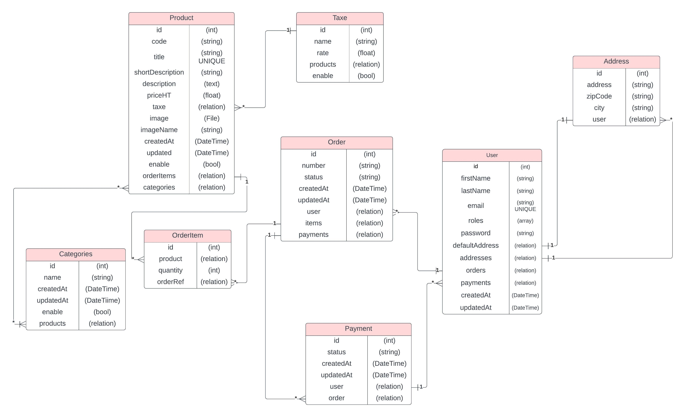

# Mise en place d'un site e-commerce Symfony

Ce module a pour but de vous former au développement avec le framework Symfony en créant un site e-commerce. Nous verrons également l'intégration de l'API de paiement Stripe sur notre application pour la partie passerelle de paiement.

Prérequis pour ce module:

- Maitrise du web statique (HTML/CSS/JS)
- Maitrise des base du langage PHP
- Maitrise du langage SQL
- Maitrise de la POO (Programmation orientée objet)
- Maitrise des fondamentaux de Symfony

## Installation et configuration de l'application

Vous allez créer une nouvelle application symfony, vous pouvez le faire avec le cli symfony dans votre terminal de commande:

```bash
symfony new e-commerce --version="7.*" --webapp
```

Ensuite vous pouvez installer le bundle webpack encore en vous rendant dans le dossier de votre nouveau projet avec votre terminal et rentrer la commande:

```bash
composer require symfony/webpack-encore-bundle
```

N'oubliez pas ensuite d'installer les dépendances node avec la commande:

```bash
yarn install
```

Vous pouvez également configurer bootstrap sur votre projet, nous allons l'utiliser pour gagner du temps sur le développement du frontend de notre application, vous pouvez retrouver la documentation en [cliquant ici](https://symfony.com/doc/current/frontend/encore/bootstrap.html).

Vous pouvez également mettre en place Sass et faire votre structure scss ainsi que vos variables et mixins si besoin.

## Connexion en Base de données

Avant de commencer, vous devez faire la connexion à votre base de données, pour ce faire, créer votre fichier **.env.local** à la racine de votre projet et ajouter votre DATABASE_URL avec les bonnes informations.

Ensuite, pour la prise en compte, faite la commande:

```shell
composer dump-env dev
```

Ensuite créez votre base de données avec la commande:

```shell
symfony console doctrine:database:create
```

## Schéma de base de données

Avant de se lancer dans le développement, nous allons d'abord présenter le schéma MCD de la base de données, ce schéma est orienté Entity de Symfony pour vous aider dans la création des entity.

Lisez attentivement le schéma et analysez le bien avant de créer une entity.

> [!NOTE]
>
> Le schéma MCD est très important pour le développement de l'application, n'hésitez pas à revenir plusieurs fois dessus pendant votre développement pour vous aider



## Création de la table user

Nous aurons besoin d'une table utilisateur afin de pouvoir connecter les utilisateurs et effectuer le suivi des commandes, de plus nous aurons besoin de sécuriser notre application admin avec des rôles.
Pour créer un configurer votre entity user, rentrez la commande:

```shell
symfony console make:user
```

Ensuite vous pouvez rajouter à votre entity user les champs suivants:

- firstName
- lastName
- createdAt
- updatedAt

Effectuez maintenant vote migration en base de donnée pour créer votre table user.

### Faire vos fixtures

Afin de gagner du temps, vous pouvez mettre en place vos fixtures pour créer au minimum un utilisateur admin en base de données.

### Gérer la connexion et la déconnexion

Maintenant, vous devez mettre en place le système de connexion et déconnexion de votre plateforme, pour ce faire, vous pouvez suivre la documentation de symfony en [cliquant ici](https://symfony.com/doc/current/security.html#form-login).

### Gérer l'inscription de vos utilisateurs

Maintenant que la connexion et déconnexion et faite sur votre application, vous pouvez faire la page d'inscription, qui devra être publique.

#### Création du formulaire User

Vous devez dans un premier temps définir le formulaire d'inscription des utilisateurs, pensez que ce formulaire sera utilisé pour la création de compte, mais également pour la partie gestion des utilisateurs en admin, mais quand le formulaire sera généré sur la page d'admin, nous ne voulons pas ajouter le champs du mot de passe et ajouter celui des rôles.

Pour créer le formulaire vous pouvez faire la commande:

```shell
symfony console make:form UserType User
```

Cette commande va vous générer le fichier du formulaire, voici à quoi il doit ressembler:

```php
class UserType extends AbstractType
{
    public function buildForm(FormBuilderInterface $builder, array $options): void
    {
        $builder
            ->add('firstName', TextType::class, [
                'label' => 'Prénom:',
                'required' => false,
                'attr' => [
                    'placeholder' =>  'John',
                ]
            ])
            ->add('lastName', TextType::class, [
                'label' => 'Nom:',
                'required' => false,
                'attr' => [
                    'placeholder' => 'Doe',
                ]
            ])
            ->add('email', EmailType::class, [
                'label' =>  'Email:',
                'required' => false,
                'attr' => [
                    'placeholder' => 'john@example.com'
                ]
            ])
            ->add('password', RepeatedType::class, [
                'type' => PasswordType::class,
                'required' => false,
                'mapped' => false,
                'invalid_message' =>  "Les mot de passe ne correspondent pas",
                'first_options' => [
                    'label' => "Mot de passe:",
                    'attr' => [
                        'placeholder' => "S3CR3T",
                    ],
                    'constraints' => [
                        new Assert\NotBlank(),
                        new Assert\Length([
                            'max' => 4096
                        ]),
                        new Assert\Regex(
                            pattern: '/^(?=.*\d)(?=.*[A-Z])(?=.*[a-z])(?=.*[^\w\d\s:])([^\s]){8,16}$/',
                            message: 'Le mot de passe doit contenir au minimum 1 lettre majuscule, minuscule, 1 chiffre et caractère spéciale'
                        )
                    ],
                    'help' => "Le mot de passe doit contenir au minimum 1 lettre majuscule, minuscule, 1 chiffre et caractère spéciale"
                ],
                'second_options' => [
                    'label' => "Confirmation mot de passe:",
                    'attr' => [
                        'placeholder' => "S3CR3T",
                    ],
                ]
            ]);

        if ($options['isAdmin']) {
            $builder->remove('password')
                ->add('enable', CheckboxType::class, [
                    'label' => 'Activé',
                    'required' => false,
                ])
                ->add('roles', ChoiceType::class, [
                    'label' => 'Roles:',
                    'placeholder' => 'Sélectionner un role',
                    'choices' => [
                        'Utilisateur' => 'ROLE_USER',
                        'Administrateur' => 'ROLE_ADMIN',
                    ],
                    'expanded' => true,
                    'multiple' => true,
                ]);
        }
    }

    public function configureOptions(OptionsResolver $resolver): void
    {
        $resolver->setDefaults([
            'data_class' => User::class,
            'isAdmin' => false,
        ]);
    }
}
```

N'oubliez pas d'importer toutes les classes que nous utilisons dans le formulaire.

#### Gérez le controller et la vue

Maintenant que vous avez votre Formulaire, vous pouvez ajouter la méthode dans un controller qui va gérer la page d'inscription,  cette méthode doit ressemble à ça:

```php
#[Route('/register', 'app.register', methods: ['GET', 'POST'])]
public function register(
    Request $request,
    EntityManagerInterface $em,
    UserPasswordHasherInterface $passwordHasher
): Response|RedirectResponse {
    $user = new User();

    $form = $this->createForm(UserType::class, $user);
    $form->handleRequest($request);

    if ($form->isSubmitted() && $form->isValid()) {
        $user->setPassword(
            $passwordHasher->hashPassword(
                $user,
                $form->get('password')->getData()
            )
        );

        $em->persist($user);
        $em->flush();

        $this->addFlash('success', 'Votre compte a bien été créé');

        return $this->redirectToRoute('app.login');
    }

    return $this->render('register.html.twig', [
        'form' => $form,
    ]);
}
```

Ensuite, vous n'avez plus qu'à faire votre vue pour afficher la page.

### Faire votre CRUD admin pour les utilisateurs

Maintenant que vous pouvez créer des utilisateurs, vous n'avez plus qu'à finir votre crud pour la partie administrateur des vos utilisateurs.

## Création de la table produit

Maintenant, nous allons devoir créer une table importante dans notre application e-commerce, la table produit.

Avant de la mettre en place, il faut d'abord analyser le schéma MCD, comment vous le voyez, il y a des relations à faire entre plusieurs table, tout d'abord nous allons mettre de côté la relation avec order que nous ferons plus tard, à l'étape de la mise en place de la partie e-commerce de l'application. 

### Gestion des Catégories

Dans un premier temps, vous allez devoir créer l'entity catégorie, suivez le schéma MCD pour mettre en place votre entity.

Ensuite, vous devez faire un CRUD sur la partie Admin de votre application pour gérer vos catégories.

Maintenant, vous devez savoir faire un CRUD simple, je vous laisse faire.

> [!TIP]
>
> Si vous  avez encore du mal à faire un CRUD, vous pouvez relire le support de cours sur les fondamentaux de Symfony

### Gestion des taxes

Une fois que vous pouvez gérer vos catégories, vous allez devoir gérer vos taxes.

Une fois encore, suivez le [schéma MCD](#Schéma de base de données) pour mettre en place votre entity.

Ensuite faite votre CRUD en admin pour gérer vos taxes.

### Création de la table produit

Maintenant que nous avons fait nos 2 entity, nous pouvons créer l'entity Produit en ajoutant les relations avec Taxe et Catégories.

N'oubliez pas d'ajouter les contraintes applicatives dans votre entity afin de valider les données lors de la création ou modifications de vos produits.

Sur nos produits, nous voulons ajouter une image, nous allons utiliser le bundle [VichUploader](https://github.com/dustin10/VichUploaderBundle) pour les images, vous devez suivre la documentation pour configurer les options de votre mapping d'upload ainsi que les propriétés ajouter dans votre entity produit.

## Gestion des produits

Maintenant que nous avons notre entity produit, nous allons pouvoir créer notre premier produit !

Nous allons mettre en place le CRUD pour les produits, donc tout d'abord, nous auront besoin d'un formulaire,  dans ce formulaire, n'oublier pas d'utiliser **l'EntityType** pour les propriétés avec les relations (Taxe et Catégorie).

Ensuite, vous allez de voir faire votre CRUD sur la partie admin de votre application.

### Génération de fixture produit

Maintenant que nous avons fait notre CRUD pour les produits, nous pouvons également générer plusieurs produits afin de gagner du temps, l'idée est de générer 50 produits aléatoires pour avoir du contenu avec lequel travailler.

Pour générer plus vite nos fixtures et avec des données plus pertinente pour nos produit, nous allons utiliser le bundle [FakerPhp](https://fakerphp.github.io/) qui est un bundle qui permet de générer du contenu aléatoire plus précis pour mieux coller à notre contexte.

Tout d'abord, vous allez devoir installer le bundle avec la commande:

```shell
composer require --dev fakerphp/faker
```

> [!CAUTION]
>
> L'argument `--dev` est important car ce bundle ne doit être utilisable seulement quand notre application est en environnement de développement, donc techniquement sur notre production, nous ne seront pas sur cet environnement, donc personne ne pourra l'utiliser, ce qui est plus sécurisé.

### Création du fichier de fixture

Maintenant que nous avons installé faker, nous allons pouvoir l'utiliser dans la génération de nos fixtures.

Pour ce faire, nous allons devoir créer une nouvelle propriété dans le fichier `AppFixtures.php` et faire la configuration dans le construct de la classe:

```php
use Faker\Factory;
use Faker\Generator;
use Doctrine\Persistence\ObjectManager;
use Symfony\Component\PasswordHasher\Hasher\UserPasswordHasherInterface;

class AppFixtures extends Fixture
{
  	// On stock l'instance de faker
    private Generator $faker;

    public function __construct(
        private UserPasswordHasherInterface $hasher,
    ) {
      	// On configure Faker en créant une instance de la Factory
        $this->faker = Factory::create('fr_FR');
    }

    public function load(ObjectManager $manager): void
    {
      // Vos fixtures
    }
}
```

Ici nous avons créé la propriété $faker qui sera une instance de la classe Generator de Faker qui va nous permettre de générer du contenu pour nos articles.

Tout d'abord, nous pouvons créer 2 taxe (TVA), pour pouvoir par la suite les attribuer à nos produits:

```php
$tva = (new Taxe)
    ->setName('TVA 10%')
    ->setRate(0.10)
    ->setEnable(true);

$manager->persist($tva);

$tva = (new Taxe)
    ->setName('TVA 20%')
    ->setRate(0.20)
    ->setEnable(true);

$manager->persist($tva);
```

Pour la suite, nous pouvons créer 10 catégories, pour faire simple, nous allons définir un tableau avec le noms de 10 catégories, et ensuite faire une boucle for avec 10 itérations pour créer les 10 catégories:

```php
$tagsArray = ['Mobile', 'Tablette', 'Ordinateur', 'Accessoire', 'Jeux', 'Console', 'TV', 'Son', 'Photo', 'Vidéo'];

for ($i = 0; $i < 10; $i++) {
    $categorie = (new Categorie)
        ->setName($tagsArray[$i])
        ->setEnable(true);

    $manager->persist($categorie);
		
  	// On stock les objets catégories pour les utiliser pendant la génération
  	// des produits
    $categories[] = $categorie;
}
```

Maintenant que nous avons généré des taxes et des catégories, nous allons pouvoir générer des produits, nous allons en générer 50 avec du contenu aléatoire, donc faire une boucle for avec 50 itérations:

```php
for ($i = 0; $i < 50; ++$i) {
 	// Génération des produits 
  $product = new Product();
}
```

Pour générer le contenu, nous allons utiliser faker, pour le titre, nous allons utiliser la méthode `unique` et word de faker, qui va nous générer 1 mot aléatoire unique pour cette boucle : 

```php
$product = (new Product)
  	->setTitle($this->faker->unique()->word());
```

Comme vous le voyez, nous utilisons la propriété faker pour pouvoir utiliser toutes les méthodes de générations de contenu proposées par faker.

Voici le code pour les propriétés "simple" des produits (sans les relation ou l'image pour le moment): 

```php
$product = (new Product)
  	->setTitle($this->faker->unique()->word())
  	// On utilise sentence pour créer une phrase de 10 mot en chaine de caractère
  	->setShortDescription($this->faker->sentence(10, true))
  	// On utilise boolean pour générer un boolean aléatoire
  	->setEnable($this->faker->boolean())
  	// On utilise randomFloat pour un nombre décimal à 2 chiffre entre 10 et 1000
  	->setPriceHT($this->faker->randomFloat(2, 10, 1000))
  	// On utilise datetimeThisYear pour un DateTime aléatoire sur l'année actuelle
  	// On utilise également createFromMutable de DateTimeImmutable pour transformer
  	// L'objet DateTime envoyé par faker en DateTimeImmutable 
  	// (attendu par la propriété) createdAt
  	->setCreatedAt(
        \DateTimeImmutable::createFromMutable($this->faker->dateTimeThisYear())
    );
```

Ici, nous avons utilisé des méthode génératives de Faker pour avoir du contenu différent et adapté à nos produits.

Maintenant, concernant la description, nous voulons avoir du contenu HTML pour une meilleure intégration sur les page frontend de notre application. Avec faker, vous pouvez générer du contenu HTML, mais le problème est qu'il va mettre la balise HTML doctype, head, body etc... Donc ce n'est pas ce que nous voulons, car ce contenu HTML sera intégrer dans une page.

Pour palier le problème, nous allons utiliser une API de génération loripsum que est une API lorem ipsum pour du contenu HTML:

```php
$product = (new Product)
  	->setTitle($this->faker->unique()->word())
  	// Utilisation de l'API loripsum
  	->setDescription(file_get_contents('https://loripsum.net/api/3/short/link/ul'))
  	// On utilise sentence pour créer une phrase de 10 mot en chaine de caractère
  	->setShortDescription($this->faker->sentence(10, true))
  	// On utilise boolean pour générer un boolean aléatoire
  	->setEnable($this->faker->boolean())
  	// On utilise randomFloat pour un nombre décimal à 2 chiffre entre 10 et 1000
  	->setPriceHT($this->faker->randomFloat(2, 10, 1000))
  	// On utilise datetimeThisYear pour un DateTime aléatoire sur l'année actuelle
  	// On utilise également createFromMutable de DateTimeImmutable pour transformer
  	// L'objet DateTime envoyé par faker en DateTimeImmutable 
  	// (attendu par la propriété) createdAt
  	->setCreatedAt(
        \DateTimeImmutable::createFromMutable($this->faker->dateTimeThisYear())
    );
```

Pour la description, nous avons utilisé la fonction native PHP file_get_contents() qui va récupérer le contenu d'un fichier, ici un fichier HTML, ensuite nous passons  en paramètre l'url de l'API loripsum en intégrant le nombre de paragraphe souhaité (3), leur taille (short), ainsi que l'intégration dans le contenu de lien a (link),  et de liste (ul).

Donc pour résumer, on appel l'API loripsum, on récupère le contenu html renvoyé par l'API, et on le définit en description de notre produit.

> [!NOTE]
>
> Vous pouvez adapté l'utilisation de l'API loripsum en fonction des besoins ainsi que du type de contenu HTML que vous voulez tester sur vos fixtures, pour plus d'informations, vous pouvez consulter la [documentation de l'API](https://loripsum.net/)

 Maintenant, nous pouvons ajouter la relation avec la dernière taxe que nous avons créé avec la boucle sur les produits: 

```php
$product = (new Product)
  ->setTitle($this->faker->unique()->word())
  ->setDescription(file_get_contents('https://loripsum.net/api/3/short/link/ul'))
  ->setShortDescription($this->faker->sentence(10, true))
  // On créé la relation
  ->setTaxe($tva)
  ->setPriceHT($this->faker->randomFloat(2, 10, 1000))
  ->setImage($this->uploadImageArticle())
  ->setEnable($this->faker->boolean())
  ->setCreatedAt(
      \DateTimeImmutable::createFromMutable($this->faker->dateTimeThisYear())
  );
```

Dernière étape avant de s'attaquer à l'image,  ce sont les catégories. C'est une relation ManyToMany, donc nous voulons de manière aléatoire définir de 1 à 4 catégories par produit, pour faire ça, nous pouvons simplement faire une boucle for avec une itération aléatoire en utilisant faker:

```php
for ($j = 0; $j < $this->faker->numberBetween(0, 4); ++$j) {
    // Ajout aléatoire d'une catégorie
}
```

Ici pour définir l'arrêt de l'itération nous demandons à faker un nombre entre 0 à 4, donc de manière aléatoire, certains produits auront de 0 à 4 catégories.

Maintenant, il faut faire également un choix aléatoire dans le tableau de catégorie (que nous avons rempli à l'étape de génération des catégories),

Pour faire ça, nous allons utiliser le tableau des catégories et choisir de manière aléatoire un index du 0 à 9:

```php
for ($j = 0; $j < $this->faker->numberBetween(0, 4); ++$j) {
    $product->addCategory($categories[$this->faker->numberBetween(0, 9)]);
}
```

Et voilà, vous avez ajouter aléatoirement les catégories à chaque produits !

#### Gestion de l'image

Pour la génération de fixtures, la gestion des images peut s'avérer être complexe,  de plus en utilisant VichUploader, car il faut "simuler" un fichier soumis via formulaire pour que Vich uploader upload le fichier au bon emplacement et stock les données en BDD.

Tout d'abord, parlons du fileSystem, ce bundle de symfony permet la gestion des fichiers sur votre projet, le fileSystem par défaut, couplé avec VichUploader, ne permet pas en passant par le fichier de fixtures de créer les fichiers dans le dossier de destination (problème de droit).

Mais VichUploader est compatible avec [gaufrette](https://github.com/KnpLabs/KnpGaufretteBundle), qui est un bundle PHP qui propose un fileSysteme robuste et sécurisé, et en plus, il va nous permettre de palier les problèmes de droits de création du fichier lors de la génération des fixtures.

Tout d'abord, nous allons installer le bundle:

```shell
composer require knplabs/knp-gaufrette-bundle
```

Ensuite, nous allons devoir configurer vich uploader pour qu'il utilise Gaufrette pour la gestion des fichiers sur notre application, vous pouvez retrouver toute les informations sur la [documentation de vich](https://github.com/dustin10/VichUploaderBundle/blob/master/docs/storage/gaufrette.md).

Comme vous le verrez, il faut modifier le fichier **config/vich_uploader.yaml**:

```yaml
# Configuration de gauffrette
knp_gaufrette:
    stream_wrapper: ~

    adapters:
    		# La définition de la configuration pour les produits
        product_adapter:
        		# On définit que les fichier seront stocker en local
        		# Dans le dossier public/images/products
            local:
                directory: "%kernel.project_dir%/public/images/products"
		# On créé un filesystems pour les produits
    filesystems:
    		# On le nomme et lui attribut la configuration faite ci-dessus
        products_fs:
            adapter: product_adapter

vich_uploader:
    db_driver: orm
    # On définit à Vich qu'il doit utiliser gaufrette pour la gestion des fichiers
    storage: gaufrette

    metadata:
        type: attribute

    mappings:
        products:
            uri_prefix: /images/products
            # On appelle simplement le fylestystem pour les produits
            # définit ci-desssus
            upload_destination: products_fs
            namer: Vich\UploaderBundle\Naming\SmartUniqueNamer

            inject_on_load: false
            delete_on_update: true
            delete_on_remove: true
```

Et voilà, vich va maintenant utiliser gaufrette pour la gestion des fichiers.

Maintenant que nous avons mis en place la configuration, il va falloir retourner dans nos fixtures pour récupérer une image de manière aléatoire et la définir sur nos produits.

Dans un premier temps, vous allez devoir créer un dossiers Images dans le dossier DataFixtures où vous allez mettre plusieurs images qui seront utilisées pour vos produits.

Ensuite vous allez créer dans AppFixture une nouvelle méthode qui va récupérer une image de manière aléatoire dans ce dossier pour simuler un upload d'image via formulaire pour ensuite la définir sur les produits:

```php
private function uploadImageArticle(): UploadedFile
{
  
}
```

Ici nous créons une méthode privée car elle ne sera utilisé que dans le fichier de fixtures, et elle va retourner un objet UploadedFile (qui simule un fichier uploadé par formulaire).

Maintenant, il faut récupérer aléatoirement une image dans le dossier d'image:

```php
private function uploadImageArticle(): UploadedFile
{
  // On utilise glob pour récupérer dans un tableau les chemins vers toutes 
  // les images du dossier Images
  $files = glob(realpath(__DIR__ . '/Images/') . '/*.*');
}
```

Maintenant, votre variable $files est un tableau qui stock tous les chemins vers les images, il ne reste plus qu'à en sélection un de manière aléatoire et créer un objet UploadedFile:

```php
private function uploadImageArticle(): UploadedFile
{
  // On utilise glob pour récupérer dans un tableau les chemins vers toutes 
  // les images du dossier Images
  $files = glob(realpath(__DIR__ . '/Images/') . '/*.*');
  
  // On va choisir au hasard un index disponible dans le tableau $files
  $index = array_rand($files);
  
  // On créer un objet File en lui passant un des chemins du tableau
  $imageFile = new File($files[$index]);
}
```

Une fois que nous en sommes ici, nous avons un objet File avec notre fichier, nous devons le transformer en objet UploadedFile avant de le retourner:

```php
private function uploadImageArticle(): UploadedFile
{
  // On utilise glob pour récupérer dans un tableau les chemins vers toutes 
  // les images du dossier Images
  $files = glob(realpath(__DIR__ . '/Images/') . '/*.*');
  
  // On va choisir au hasard un index disponible dans le tableau $files
  $index = array_rand($files);
  
  // On créer un objet File en lui passant un des chemins du tableau
  $imageFile = new File($files[$index]);
  
  $uploadedFile = new UploadedFile($imageFile,  $imageFile->getFilename());
  
  return $uploadedFile;
}
```

Pour créer l'objet UploadedFile, nous devons lui passer le fichier ainsi que le nom du fichier *`($imageFile->getFilename())`* et ensuite nous retournons notre objet UploadedFile pour l'intégrer dans le produit:

```php
for ($i = 0; $i < 50; ++$i) {
  $product = (new Product)
      ->setTitle($this->faker->unique()->word())
      ->setDescription(file_get_contents('https://loripsum.net/api/3/short/link/ul'))
      ->setShortDescription($this->faker->sentence(10, true))
      ->setTaxe($tva)
      ->setPriceHT($this->faker->randomFloat(2, 10, 1000))
    	// Nous utilisons la méthode nouvellement créée pour uploader 
    	//une image aléatoire
      ->setImage($this->uploadImageArticle())
      ->setEnable($this->faker->boolean())
      ->setCreatedAt(
          \DateTimeImmutable::createFromMutable($this->faker->dateTimeThisYear())
      );

  for ($j = 0; $j < $this->faker->numberBetween(0, 4); ++$j) {
      $product->addCategory($categories[$this->faker->numberBetween(0, 9)]);
  }
}
```

Dernière chose à faire avant de terminer la boucle de génération de produit, persister chaque produit pour ensuite, à l'extérieur de la boucle for, faire un flush qui va exécuter toutes les requêtes en file d'attente jusqu'ici:

```php
for ($i = 0; $i < 50; ++$i) {
    $product = (new Product)
        ->setTitle($this->faker->unique()->word())
        ->setDescription(file_get_contents('https://loripsum.net/api/3/short/link/ul'))
        ->setShortDescription($this->faker->sentence(10, true))
        ->setTaxe($tva)
        ->setPriceHT($this->faker->randomFloat(2, 10, 1000))
        ->setImage($this->uploadImageArticle())
        ->setEnable($this->faker->boolean())
        ->setCreatedAt(
            \DateTimeImmutable::createFromMutable($this->faker->dateTimeThisYear())
        );

    for ($j = 0; $j < $this->faker->numberBetween(0, 4); ++$j) {
        $product->addCategory($categories[$this->faker->numberBetween(0, 9)]);
    }

    $manager->persist($product);
}

$manager->flush();
```

Pour s'y retrouver un peu, voici l'exemple complet du fichier de fixture (qui comprend également un utilisateur admin car la base de données sera purgée en chargeant les fixtures): 

```php
class AppFixtures extends Fixture
{
    private Generator $faker;

    public function __construct(
        private UserPasswordHasherInterface $hasher,
    ) {
        $this->faker = Factory::create('fr_FR');
    }

    public function load(ObjectManager $manager): void
    {
        $user = (new User())
            ->setEmail('pierre@test.com')
            ->setFirstName('Pierre')
            ->setLastName('Bertrand')
            ->setPassword(
                $this->hasher->hashPassword(
                    new User(),
                    'Test1234!'
                )
            )
            ->setRoles(['ROLE_ADMIN'])
            ->setEnable(true);

        $manager->persist($user);

        $tva = (new Taxe)
            ->setName('TVA 10%')
            ->setRate(0.10)
            ->setEnable(true);

        $manager->persist($tva);

        $tva = (new Taxe)
            ->setName('TVA 20%')
            ->setRate(0.20)
            ->setEnable(true);

        $manager->persist($tva);

        $tagsArray = ['Mobile', 'Tablette', 'Ordinateur', 'Accessoire', 'Jeux', 'Console', 'TV', 'Son', 'Photo', 'Vidéo'];

        for ($i = 0; $i < 10; $i++) {
            $categorie = (new Categorie)
                ->setName($tagsArray[$i])
                ->setEnable(true);

            $manager->persist($categorie);

            $categories[] = $categorie;
        }

        for ($i = 0; $i < 50; ++$i) {
            $product = (new Product)
                ->setTitle($this->faker->unique()->word())
                ->setDescription(file_get_contents('https://loripsum.net/api/3/short/link/ul'))
                ->setShortDescription($this->faker->sentence(10, true))
                ->setTaxe($tva)
                ->setPriceHT($this->faker->randomFloat(2, 10, 1000))
                ->setImage($this->uploadImageArticle())
                ->setEnable($this->faker->boolean())
                ->setCreatedAt(
                    \DateTimeImmutable::createFromMutable($this->faker->dateTimeThisYear())
                );

            for ($j = 0; $j < $this->faker->numberBetween(0, 4); ++$j) {
                $product->addCategory($categories[$this->faker->numberBetween(0, 9)]);
            }

            $manager->persist($product);
        }

        $manager->flush();
    }

    private function uploadImageArticle(): UploadedFile
    {
        /** @var array<string> $files */
        $files = glob(realpath(__DIR__ . '/Images/Articles/') . '/*.*');

        $file = array_rand($files);

        $imageFile = new File($files[$file]);
        $uploadFile = new UploadedFile($imageFile, $imageFile->getFilename());

        return $uploadFile;
    }
}
```

> [!WARNING]
>
> N'oubliez pas d'importer toutes les classes utilisées dans le fichiers.

Et maintenant, vous n'avez plus qu'à faire la commande pour charger les fixtures:

```shell
symfony conosole doctrine:fixtures:load
```

Et voilà, vous avez déjà 50 produits sur votre application, il ne vous reste plus qu'à gérer les pages du front (page qui liste tous les produits actif pour les utilisateurs). Je vous laisse faire le controller et la vue.

## La pagination

Étant donnée que nous avons beaucoup de produits, la page de liste va être assez longue, donc pour optimiser l'expérience utilisateur sur cette page, nous allons vouloir mettre en place un système de pagination.

Pour faciliter le travail,  nous pouvons utiliser le bundle [KnpPaginatorBundle](https://github.com/KnpLabs/KnpPaginatorBundle), qui va nous permettre très rapidement de mettre en place une pagination.

Tout d'abord installez le bundle:

```shell
composer require knplabs/knp-paginator-bundle
```

Ensuite nous allons devoir le configurer, surtout pour la partie frontend et affichage des liens de pagination, si vous suivez la documentation, il faut avoir un fichier **config/packages/knp_paginator.yaml** et modifier la partie template qui est noté dans la documentation:

```yaml
knp_paginator:
    page_range: 5 # number of links shown in the pagination menu (e.g: you have 10 pages, a page_range of 3, on the 5th page you'll see links to page 4, 5, 6)
    default_options:
        page_name: page # page query parameter name
        sort_field_name: sort # sort field query parameter name
        sort_direction_name: direction # sort direction query parameter name
        distinct: true # ensure distinct results, useful when ORM queries are using GROUP BY statements
        filter_field_name: filterField # filter field query parameter name
        filter_value_name: filterValue # filter value query parameter name
    template:
    		# On change les chemins vers les templates twig pour la pagination ainsi que les autres
    		# en utilisant bootstrap (pour mieux coller avec le design de notre application)
        pagination: "@KnpPaginator/Pagination/bootstrap_v5_pagination.html.twig" # sliding pagination controls template
        sortable: "@KnpPaginator/Pagination/bootstrap_v5_bi_sortable_link.html.twig" # sort link template
        filtration: "@KnpPaginator/Pagination/bootstrap_v5_filtration.html.twig" # filters template

```

Et voilà, pas plus de configuration à faire pour ce bundle, maintenant, il va falloir créer une méthode de recherche custom en utilisant le bundle dans le **ProductRepository**, voici l'exemple de base sans pagination:

```php
# ProductRepository.php

public function createListShop(bool $includeDisable = false): array
{
  $query = $this->createQueryBuilder('p')
      ->select('p, c, t')
      ->leftJoin('p.categories', 'c')
      ->join('p.taxe', 't');

  if (!$includeDisable) {
      $query->andWhere('p.enable = true');
  }

  $query
      ->orderBy('p.createdAt', 'DESC');
  
	return $query
    ->getQuery()
    ->getResult();
}
```

Maintenant, nous allons vouloir utiliser le bundle de pagination, tout d'abord, nous allons créer une nouvelle propriété dans le ProductRepository avec une instance de la PaginatorInterface:

```php
public function __construct(
    ManagerRegistry $registry,
    private PaginatorInterface $paginator
) {
    parent::__construct($registry, Product::class);
}
```

Très bien, maintenant, nous allons vouloir l'utiliser dans notre méthode `createListShop` pour que plutôt que de renvoyer un tableau simple, on renvoie un objet PaginationInterface qui va nous permettre de gérer facilement la pagination:

```php
public function createListShop(bool $includeDisable = false): PaginationInterface
{
  $query = $this->createQueryBuilder('p')
      ->select('p, c, t')
      ->leftJoin('p.categories', 'c')
      ->join('p.taxe', 't');

  if (!$includeDisable) {
      $query->andWhere('p.enable = true');
  }

  $query
      ->orderBy('p.createdAt', 'DESC')
    	->getQuery();
  
  // On utilise la méthode paginate en lui parrant la requête pour créer l'objet
	return $this->paginator->paginate(
  		// On lui passe la requête
    	$query,
    	// On définit le numéro de la page
    	1,
    	// On définit le nombre d'élément par page
    	6,
  );
}
```

Vous voyez que dans la méthode paginate, nous définissons "en dur" les valeurs de la page actuelle ainsi que le nombre d'éléments par page.

Bien entendu, nous allons devoir le définir dynamiquement, dans un premier temps, nous allons ajouter ces 2 paramètres à notre méthode createListShop et les utiliser dans la méthode paginate:

```php
public function createListShop(
  	bool $includeDisable = false, 
  	int $page = 1, 
  	int $maxPerPage = 6
): PaginationInterface {
    $query = $this->createQueryBuilder('p')
        ->select('p, c, t')
        ->leftJoin('p.categories', 'c')
        ->join('p.taxe', 't');

    if (!$includeDisable) {
        $query->andWhere('p.enable = true');
    }

    $query
        ->orderBy('p.createdAt', 'DESC')
        ->getQuery();

    return $this->paginator->paginate(
        $query,
        $page,
        $maxPerPage
    );
}
```

Maintenant que nous avons notre requête custom qui renvoie un objet pagination, nous allons devoir l'exécuter dans notre controller et dans la méthode index des produits en front:

```php
#[Route('', '.index', methods: ['GET'])]
public function index(Request $request): Response
{
    return $this->render('Frontend/Products/index.html.twig', [
        'products' => $this->productRepo->createListShop(false, $request->query->getInt('page', 1), 6),
    ]);
}
```

Ic, vous voyez que dans les paramètres, nous récupérons la requête du navigateur, elle va nous servir pour récupérer le numéro de la page sur laquelle le client est, ce numéro sera en paramètre GET (`?page=2`).

Ensuite vous voyez qu'on exécute la méthode `createListShop` en lui passant les valeurs:

- `$request->query->getInt('page', 1)` -> Récupération dynamique du numéro de la page en récupérant le paramètre GET page, si le paramètre n'est pas présent, on définit la page sur 1
- `6` -> le nombre de produit par page

Concernant la vue, l'objet pagination s'utilise comme un tableau classique pour afficher les éléments de la page (avec une boucle for):

```twig

  

```

Maintenant, nous voulons générer les boutons de paginations par rapport aux nombre de page disponible, pour ce faire, le bundle vous fournit une nouvelle méthode twig ` knp_pagination_render()` qui permet de générer automatiquement la pagination quand on lui passe un objet de la PaginationInterface, donc pour afficher la pagination en dessous de la boucle for, vous pouvez rajouter:

```twig 
<div class="mt-4">
  {{ knp_pagination_render(products) }}
</div>
```

Et voilà, vous avez déjà une pagination dynamique, vous pouvez cliquer sur les liens de la pagination, vous verrez que vous changerez de page.

Il ne vous reste plus qu'à faire la vue de détails (show) pour chaque produit (nous en auront besoin pour l'étape suivante).

## Mise en place de la partie E-commerce

Maintenant que nous avons mis en place la partie produit, il va falloir nous intéresser à la partie e-commerce de notre application. Dans un premier temps, prenons du recule, comment stocker nos commandes, les produits, les users, les paiements ?

Pour le moment laissons de côté le paiement, qui fera l'objet d'un module complet dans ce cours plus tard.

C'est là où il faut s'appliquer et prendre son temps pour décortiquer la logique métier de notre application.

Concrètement nous voulons qu'un utilisateur puisse faire une commande, cette commande va pouvoir stocker plusieurs produits, mais également pour chaque produit, nous voulons également une quantité pour calculer le prix total de la commande.

Cette commande devra être rattachée à un utilisateur et aura plusieurs état, il faut imaginer que la commande va suivre l'utilisateur dès la mise dans panier d'un produit, jusqu'à la validation du paiement.

Donc, si nous inspectons le schéma [MCD](#Schéma de base de données), nous voyons que les produits sont relié à une entity OrderItem (qui n'est pas une commande, mais "une ligne" dans la commande), c'est également grâce à ça que nous allons pouvoir ajouter la dimension de quantité (qui n'est pas présente dans l'entity Produit). Voyez cette entity OrderItem comme une sorte de table de liaison améliorée étant donnée que nous stockons également la quantité commandé du produit dans la commande. Ensuite, sur le schéma, nous voyons que cet entity OrderItem est relié à l'entity Order en ManyToOne car une commande peut avoir plusieurs OrderItem, mais un OrderItem ne peut avoir qu'une commande.

Maintenant, vous pouvez créer les 2 entity **Order** et **OrderItem**.

Pour l'entity Order, nous allons définir des constantes pour définir les différents status que peut avoir une commande, donc dans l'entity Order, vous allez rajouter ces constantes:

```php
public const STATUS_CART = 'cart';
public const STATUS_NEW = 'new';
public const STATUS_CHECKOUT_COMPLETED = 'checkout_completed';
public const STATUS_PAID = 'paid';
public const STATUS_PAYMENT_FAILED = 'payment_failed';
public const STATUS_SHIPPED = 'shipped';
public const STATUS_CANCELLED = 'canceled';
```

Cette étape va nous permettre de gérer plus facilement les différentes étapes par lesquels vont passer les commandes.

Pour ces 2 nouvelles entity,  nous n'allons pas faire un CRUD "classique", nous n'allons pas avoir un OrderController pour faire tous le CRUD, nous allons découper ensemble les étapes.

Concrètement, pour créer un objet order, nous voulons que sur la page de détails d'un produit,  nous puissions soumettre un formulaire avec une quantité pour ajouter au panier le produit, dès la première mise dans le panier d'un produit, nous créons un objet Order que nous relions à l'utilisateur et que nous stockons également en session, et en plus de ça, le fait de soumette le formulaire avec une quantité va créer automatiquement un objet OrderItem, que nous allons relié à la commande.

Je sais, ça fait beaucoup d'informations d'un coup, mais nous allons décortiquer tout ça ensemble.

Avant de mettre en place notre formulaire et faire la fonctionnalité d'ajout au panier d'un produit, nous allons devoir se créer un nouveau Manager pour gérer notre panier et une nouvelle Factory pour créer nos commandes,  gérer l'ajout d'un produit, la création d'un panier etc..

Concrètement, ce nouveau Manager et cette nouvelle Factory vont nous permettre d'isoler la logique métier de notre panier afin de faciliter son utilisation dans les méthodes de nos controllers.

> [!TIP]
>
> Avec Symfony, et la logique MVC, n'hésitez pas à vous créer dès que besoin des Services, Factory, Manager ou autre.

### Création de l'OrderFactory

C'est partie, nous allons créer notre `OrderFactory`, sont but sera simplement de créer un nouvel objet Order, et de pouvoir ajouter des OrderItems à l'intérieur. 

Tout d'abord, vous allez créer un dossier Factory dans le dossier src de votre application.

À l'intérieur, vous allez créer un fichier **OrderFactory**:

```php
<?php

namespace App\Factory;

class OrderFactory
{
}
```

Parfait, nous allons pouvoir créer 2 méthodes qui vont permettre de créer une nouvelle commande et de pouvoir ajouter des OrderItems dans une Order:

```php
<?php

namespace App\Factory;

class OrderFactory
{
  	/**
     * Creates an order
     *
     * @return Order
     */
    public function create(): Order
    {
       // Création d'une commande
    }
  
  	/**
     * Create an item for a product
     *
     * @param Product $product
     *
     * @return OrderItem
     */
    public function createItem(Product $product): OrderItem
    {
    }
}
```

Pour la méthode create, qui va créer un nouvel objet Order, nous voulons faire 3 choses:

- Créer un nouvel objet Order
- Si un utilisateur est connecté actuellement, relier la commande à l'utilisateur
- Définir le status de la commande à cart pour indiqué que cette commande est pour le moment dans le panier.

Pour vérifier si un utilisateur est connecté actuellement, étant donnée que nous ne sommes pas dans un controller, nous allons devoir utiliser une instance de la classe Security de Symfony qui gère toute la sécurité de votre application (notamment l'utilisateur connecté actuellement), donc nous allons créer une propriété qui va stocker cet instance:

```php
public function __construct(
    private Security $security
) {
}
```

N'oubliez pas d'importer la classe Security.

Maintenant que nous pouvons utiliser cet instance,  nous allons pouvoir développer la méthode create qui va créer une commande:

```php
public function create(): Order
{
  	// On crée la commande
    $order = new Order();

  	// Si un utilisateur est connecté actuellement, on le relie à la nouvelle commande 
    if ($this->security->getUser()) {
        $order->setUser($this->security->getUser());
    }
		
  	// On retourne la nouvelle commande en définissant le status à cart
    return $order
        ->setStatus(Order::STATUS_CART);
}
```

Maintenant, nous allons développer la méthode pour créer un objet OrderItem:

```php
public function createItem(Product $product): OrderItem
{
    return (new OrderItem())
        ->setProduct($product)
        ->setQuantity(1);
}
```

Et voilà, nous pouvons maintenant utiliser notre OrderFactory pour créer rapidement des commandes, l'avantage d'un tel service est qu'on peut définir la logique de la création des commandes dans une classe, ainsi, dans nos controller, ça nous facilitera la vi et nous fera gagner du temps.

Maintenant, nous allons aborder un nouveau type de service: le Manager.

### Création du CartManager

Maintenant que nous avons un service qui nous permet de créer facilement des commandes, nous allons mettre en place un autre service qui va nous permettre de gérer les paniers sur notre application, c'est ce qu'on appel un manager.

Dans cette classe, nous allons définir toute la logique de gestion du panier pour notre application.

Pour commencer, ajouter un dossier **Manager** dans le dossier src et créer un fichier **CartManager**:

```php
<?php

namespace App\Manager;

class CartManager
{
}
```

Dans ce manager nous allons développer 2 méthodes:

- La première pour récupérer le panier de l'utilisateur actuel ou en créer un nouveau
- Sauvegarder des modifications apporter sur le panier

Donc vous pouvez déjà créer ces 2 méthodes:

```php
<?php

namespace App\Manager;

use App\Entity\Order;

class CartManager
{
    /**
     * Get the current cart
     * 
     * @return Order
     */
    public function getCurrentCart(): Order
    {
      // Ajout de la logique pour récupérer le panier de l'utilisateur ou en créer un nouveau
    }
  
  	/**
     * Persists the cart in database and session
     *
     * @param Order $cart
     */
    public function save(Order $cart): void
    {
      // Ajout de la logique de persistance en BDD
    }
}
```

Concrètement pour ces 2 méthodes, nous pouvons déjà identifier que nous allons avoir besoin de 2 classes:

- l'EntityManagerInterface pour la persistence de données
- Notre OrderFactory pour pouvoir créer une nouvelle commande si l'utilisateur n'a pas encore de panier

Donc nous allons déjà ajouter ces 2 classes dans des propriétés pour pouvoir les utiliser:

```php
<?php

namespace App\Manager;

use App\Entity\Order;
use App\Factory\OrderFactory;
use Doctrine\ORM\EntityManagerInterface;

class CartManager
{
  	public function __construct(
  			private EntityManagerInterface $em,
     		private OrderFactory $orderFactory,
    ) {
    }
  
    /**
     * Get the current cart
     * 
     * @return Order
     */
    public function getCurrentCart(): Order
    {
      // Ajout de la logique pour récupérer le panier de l'utilisateur ou en créer un nouveau
    }
  
  	/**
     * Persists the cart in database and session
     *
     * @param Order $cart
     */
    public function save(Order $cart): void
    {
      // Ajout de la logique de persistance en BDD
    }
}
```

Très bien, maintenant, il faut se pencher un peu plus sur la partie stockage du panier,  concrètement, nous allons sauvegarder la relation avec une commande avec un utilisateur en base de données mais **seulement** si un utilisateur est connecté actuellement, mais que faire si un utilisateur n'est pas connecté à notre application ? 

Pour palier le problème, nous allons utiliser la session PHP en plus de la sauvegarde en BDD quand c'est possible.

Pour gérer la gestion du panier en Session, et parce que nous sommes de bons développeurs, qui produisent du code propre et factorisé, nous allons nous créer un nouveau service (Et oui, encore un), ce nouveau service va nous permettre de manipuler la session pour le panier.

### Création du Storage Session Cart

Comme dit précédemment, nous allons utiliser la session PHP avec Symfony afin de pouvoir ajouter en session un panier, ou récupérer un panier depuis la session.

Pour ce faire, nous voulons suivre jusqu'au bout la logique MVC et séparer la gestion des sessions du panier du CartManager, donc nous allons créer un nouveau service qui nous permettra de gérer la session et nos panier.

Pour commencer vous allez créer un nouveau dossier Storage (c'est dans ce dossier que vous mettrez vos service de gestion de Storage en session),  et à l'intérieur, vous allez créer un fichier **CartSessionStorage.php**:

```php
<?php

namespace App\Storage;

class CartSessionStorage
{
}
```

Comme je l'expliquez, cette classe va nous permettre de récupérer un panier en session et d'en créer un:

```php
<?php

namespace App\Storage;

use App\Entity\Order;

class CartSessionStorage
{
  public function getCart(): ?Order
  {
		// Récupération du panier
  }
  
  public function setCart(Order $cart): void
  {
      // Création d'un panier en session
  }
}
```

D'abord, nous allons nous intéresser à la méthode setCart qui nous permettra de placer un panier en session.

### Définir un panier en session

Tout d'abord,  pour manipuler la session PHP en Symfony, il faut récupérer la session de l'utilisateur, pour ça nous allons devoir passer par la requête du client en utilisant la classe `RequestStack` de Symfony, donc nous allons ajouter une propriété qui stock cette objet:

```php
<?php

namespace App\Storage;

use App\Entity\Order;
use Symfony\Component\HttpFoundation\RequestStack;

class CartSessionStorage
{
  public function __construct(
      private RequestStack $requestStack,
  ) {
  }
  
  public function getCart(): ?Order
  {
		// Récupération du panier
  }
  
  public function setCart(Order $cart): void
  {
      // Création d'un panier en session
  }
}
```

Maintenant, en appelant la propriété `$requestStack`,  nous pourrons récupérer la requête du client, maintenant, nous savons que pour toute les méthodes de cette classe, nous allons devoir récupérer la session de l'utilisateur pour la manipuler, donc pour faire un code propre, nous pouvons créer une méthode privée dans cette classe qui va simplement récupérer la session de l'utilisateur et nous la renvoyer: 

```php
<?php

namespace App\Storage;

use App\Entity\Order;
use Symfony\Component\HttpFoundation\RequestStack;
use Symfony\Component\HttpFoundation\Session\SessionInterface;

class CartSessionStorage
{
  public function __construct(
      private RequestStack $requestStack,
  ) {
  }
  
  public function getCart(): ?Order
  {
		// Récupération du panier
  }
  
  public function setCart(Order $cart): void
  {
      // Création d'un panier en session
  }
  
  private function getSession(): SessionInterface
  {
      return $this->requestStack->getSession();
  }
}
```

Maintenant notre méthode getSession() va automatiquement nous renvoyer la session de l'utilisateur.

Ensuite, si on regarde plus en détails la méthode `setCart` qui a pour but de mettre un panier en session, nous voyons que nous attendons un paramètre qui est un objet de type Order (qui représente une commande). Donc le but maintenant, est de mettre l'id de l'objet Order en session pour pouvoir le récupérer plus facilement, mais pour définir une valeur en session, nous avons besoin de définir une clé ($_SESSION est un tableau associatif (clé/valeur)), donc nous pouvons créer une constante dans cette classe avec la clé que nous donnerons au panier en session:

```php
class CartSessionStorage
{
  // On définit le nom de la clé pour mettre l'id de la commande en session
  public const CART_KEY_NAME = 'cart_id';
  
  public function __construct(
      private RequestStack $requestStack,
  ) {
  }
  
  public function getCart(): ?Order
  {
		// Récupération du panier
  }
  
  public function setCart(Order $cart): void
  {
      // Création d'un panier en session
  }
  
  private function getSession(): SessionInterface
  {
      return $this->requestStack->getSession();
  }
}
```

Dernière étape pour notre méthode setSession, c'est de définir en session la clé que nous venons de définir et de lui passer la valeur (l'id de l'objet Order):

```php
class CartSessionStorage
{
  // On définit le nom de la clé pour mettre l'id de la commande en session
  public const CART_KEY_NAME = 'cart_id';
  
  public function __construct(
      private RequestStack $requestStack,
  ) {
  }
  
  public function getCart(): ?Order
  {
		// Récupération du panier
  }
  
  public function setCart(Order $cart): void
  {
      $this->getSession()->set(self::CART_KEY_NAME, $cart->getId());
  }
  
  private function getSession(): SessionInterface
  {
      return $this->requestStack->getSession();
  }
}
```

Ici nous utilisons notre méthode getSession pour récupérer la session de l'utilisateur, et nous définissons en clé la constante que nous venons de créer, et en valeur l'id de la commande. Et voilà, votre CartSessionStorage peut maintenant passer un panier en Session !

### Récupérer un panier en session

Maintenant, la deuxième action que va faire notre gestionnaire de session pour les paniers et de récupérer le panier à partir de la session (`getCart()`).

Si on prend du recul, le process pour récupérer le panier est simplement de récupérer dans la session l'id de l'objet order (la panier pour le moment) et de rechercher dans la table Order pour récupérer toutes les données.

Donc vous l'aurez compris, nous allons devoir utiliser le repository **OrderRepository**, ajouter la propriété dans le construit: 

```php
public function __construct(
    private RequestStack $requestStack,
  	private OrderRepository $cartRepository,
) {
}
```

Toujours dans une logique de propreté du code, nous allons créer une petite méthode privée qui va simplement permettre de récupérer la valeur de l'id de l'objet Order dans la session:

```php
private function getCartId(): ?int
{
    return $this->getSession()->get(self::CART_KEY_NAME);
}
```

Ici vous voyez qu'on va simplement récupérer la session de notre utilisateur et d'essayer de récupérer l'id du panier et le renvoyer.

Ensuite nous allons dans la méthode getCart l'utiliser pour chercher en BDD l'objet Order, le récupérer et renvoyer cet objet:

```php
public function getCart(): ?Order
{
    return $this->cartRepository->findOneBy([
        'id' => $this->getCartId(),
        'status' => Order::STATUS_CART
    ]);
}
```

Ici, nous utilisons simplement la méthode `findOneBy` de symfony pour trouvé un objet Order par l'id qu'on récupère en session, et nous voulons également que cet objet soit en status *panier* (si la commande est déjà validé, la méthode getCart ne doit pas renvoyer l'objet). 

Et voilà, votre gestionnaire de panier en session est terminé, voici le fichier global:

```php
<?php

namespace App\Storage;

use App\Entity\Order;
use App\Repository\OrderRepository;
use Symfony\Component\HttpFoundation\RequestStack;
use Symfony\Component\HttpFoundation\Session\SessionInterface;

/**
 * Class for cart storage session
 */
class CartSessionStorage
{
    public const CART_KEY_NAME = 'cart_id';

    public function __construct(
        private RequestStack $requestStack,
        private OrderRepository $cartRepository,
    ) {
    }

    /**
     * Get the cart in session.
     *
     * @return Order|null
     */
    public function getCart(): ?Order
    {
        return $this->cartRepository->findOneBy([
            'id' => $this->getCartId(),
            'status' => Order::STATUS_CART
        ]);
    }

    /**
     * Set the cart in session.
     *
     * @param Order $cart
     */
    public function setCart(Order $cart): void
    {
        $this->getSession()->set(self::CART_KEY_NAME, $cart->getId());
    }

    /**
     * Returns the cart id.
     *
     * @return int|null
     */
    private function getCartId(): ?int
    {
        return $this->getSession()->get(self::CART_KEY_NAME);
    }

  	/**
  	* Get the session of actual user
  	*
  	*	@return SessionInterface
  	*/
    private function getSession(): SessionInterface
    {
        return $this->requestStack->getSession();
    }
}
```

### Utiliser le CartSessionStorage dans le Manager

Maintenant que notre CartSessionStorage est fonctionnel, nous allons pouvoir l'utiliser dans notre manager, notamment dans la méthode getCurrentCart():

```php
<?php

namespace App\Manager;

use App\Entity\Order;
use App\Factory\OrderFactory;
use App\Storage\CartSessionStorage;
use Doctrine\ORM\EntityManagerInterface;

class CartManager
{
  	public function __construct(
  			private EntityManagerInterface $em,
     		private OrderFactory $orderFactory,
      	// On ajoute la propriété pour l'utiliser
      	private CartSessionStorage $cartStorage,
    ) {
    }
  
    /**
     * Get the current cart
     * 
     * @return Order
     */
    public function getCurrentCart(): Order
    {
      // On récupère le panier dans la session (ou null s'il n'y en avait pas)
      $cart = $this->cartStorage->getCart();
    }
  
  	// ...
}
```

Parfait, maintenant, nous avons le panier de la session s'il y en avait déjà, sinon $cart est null.

Maintenant, nous allons devoir vérifier si le panier est null ou non, s'il est null, c'est qu'il n'y en avait pas en session, et que nous devons créer une nouvelle commande et dans tous les cas renvoyer l'objet order:

```php
/**
 * Get the current cart
 * 
 * @return Order
 */
public function getCurrentCart(): Order
{
  // On récupère le panier dans la session (ou null s'il n'y en avait pas)
  $cart = $this->cartStorage->getCart();
  
  return $cart ?? $this->orderFactory->create();
}
```

Et oui, on peut le faire comme ça !

La ligne du return va effectuer plusieurs actions:

- Elle va retourner l'objet que nous lui passerons
- Le `??` est une manière dans un return de faire une vérification, un petit peu comme un ternaire, si $cart n'est pas null, la méthode renvoie $cart. Mais si la variable $cart est nulle, php va exécuter $this->orderFactory->create() qui va créer une nouvelle commande et la renvoyer.

Mais en faisant ça, on peut créer un problème d'utilisation de notre application, à savoir que si un utilisateur connecté avait déjà créé un panier avec des produits, qu'ensuite il n'a pas finalisé sa commande, et qu'une fois qu'il est revenu sur l'application il n'était plus connecté à son compte et remet quelque chose dans son panier, il perd par défaut son premier panier.

À l'inverse, si un utilisateur vide ses cookies (reboot la session), il perd également son panier, donc il faudrait vérifier si l'utilisateur connecté n'a pas un panier en cours en BDD,  si c'est le cas, plutôt que d'utiliser la session, nous allons utiliser les données de la BDD pour renvoyer le panier.

Pour palier ce problème, nous pouvons ajouter un peu plus de logique à notre méthode getCurrentCart en ajoutant des vérification pour savoir si un utilisateur est connecté actuellement, donc nous avons besoin de 2 nouvelles propriétés, la classe Security pour récupérer l'utilisateur connecté, l'OrderRepository pour chercher en BDD si il n'y a pas un panier en cours pour l'utilisateur connecté:

```php
public function __construct(
    private CartSessionStorage $cartStorage,
    private OrderFactory $orderFactory,
    private EntityManagerInterface $em,
    private Security $security,
    private OrderRepository $orderRepo,
) {
}
```

Ensuite nous allons devoir modifier notre méthode getCurrentCart():

```php
/**
 * Get the current cart
 * 
 * @return Order
 */
public function getCurrentCart(): Order
{
  // On récupère le panier dans la session (ou null s'il n'y en avait pas)
  $cart = $this->cartStorage->getCart();
  $user = $this->security->getUser();
  
  // On vérifie s'il n'y a pas de panier en session
  if (null === $cart) {
    	// On vérifie s'il y a un utilisateur connecté actuellement
    	if ($user) {
        	// On exécute une méthode custom dans le repo pour essayer de récupérer le dernier panier
        	// de l'utilisateur connecté
        	$cart = $this->orderRepo->findLatestCartUser($user);
      }
  }
  
  return $cart ?? $this->orderFactory->create();
}
```

Comme vous pouvez le voir, il va falloir créer cette méthode custom dans l'OrderRepository:

```php
public function findLastCartUser(User $user): ?Order
{
    return $this->createQueryBuilder('c')
        ->andWhere('c.user = :user')
        ->andWhere('c.status = :status')
        ->setParameter('user', $user)
        ->setParameter('status', Order::STATUS_CART)
        ->getQuery()
        ->getOneOrNullResult();
}
```

Très bien, maintenant, nous avons pris en compte le contexte où il n'y a pas de session, mais que l'utilisateur connecté a un panier en cours, donc plutôt que d'utiliser la session, à défaut, nous cherchons en BDD l'information pour renvoyer un panier.

Maintenant, il faut gérer le cas où un utilisateur n'était pas connecté en faisant son panier, mais qu'à un moment donnée, il décide de se connecter, dans se cas de figure, il va falloir récupérer le panier en session, vérifier si le panier que nous avons récupéré en session n'est pas encore rattaché à un utilisateur, le cas échéant rattacher le panier à l'utilisateur connecté:

```php
/**
 * Get the current cart
 * 
 * @return Order
 */
public function getCurrentCart(): Order
{
  // On récupère le panier dans la session (ou null s'il n'y en avait pas)
  $cart = $this->cartStorage->getCart();
  $user = $this->security->getUser();
  
  // On vérifie s'il n'y a pas de panier en session
  if (null === $cart) {
    	// On vérifie s'il y a un utilisateur connecté actuellement
    	if ($user) {
        	// On exécute une méthode custom dans le repo pour essayer de récupérer le dernier panier
        	// de l'utilisateur connecté
        	$cart = $this->orderRepo->findLatestCartUser($user);
      }
   	// On vérifie que le panier récupérer n'a pas d'utilisateur 
    // et qu'un utilisateur est connecté actuellement
  } elseif (null $cart->getUser() && $user) {
    	// On rattache le panier à l'utilisateur
    	$cart->setUser($user);
  }
  
  return $cart ?? $this->orderFactory->create();
}
```

Parfait, maintenant, nous allons pousser le vice et vérifier encore un autre contexte et le gérer; Le cas où le panier en session n'avait pas d'utilisateur relié, mais que l'utilisateur avait déjà un panier en cours en BDD, actuellement,  par défaut l'utilisateur va perdre son ancien panier qui est sauvegardé en BDD. Le problème c'est que nous nous retrouvons avec 2 paniers:

- 1 qui provient de la session
- 1 autre qui provient de la BDD

Pas de panique, nous allons tout simplement fusionner les 2 paniers pour n'en faire qu'un seul.

Pour ça, nous allons créer une petite méthode privée qui va simplement fusionner 2 paniers (afin d'éviter d'alourdir le code de notre méthode getCurrentCart):

```php
private function mergeCarts(Order $cart, Order $cartOld): Order
{
  	// On boucle sur les OrderItems de l'ancien panier de l'utilisateur
    foreach ($cartOld->getItems() as $item) {
      	// Pour chaque OrderItem de l'ancien panier, on transfert la relation dans le nouveau panier
        $cart->addItem($item);
    }
		
  	// On supprime ensuite l'ancien panier
    $this->em->remove($cartOld);
    $this->em->flush();

  	// On retourne le nouveau panier fusionné avec l'ancien
    return $cart;
}
```

Et voilà, toutes les informations de l'ancien panier viennent d'être fusionné dans le nouveau panier.

Maintenant, nous allons devoir utiliser cette méthode dans notre méthode `getCurrentCart()`: 

```php
/**
 * Get the current cart
 * 
 * @return Order
 */
public function getCurrentCart(): Order
{
    $cart = $this->cartStorage->getCart();
    $user = $this->security->getUser();

    if (null === $cart) {
        if ($user) {
            $cart = $this->orderRepo->findLastCartUser($user);
        }
    } elseif (null === $cart->getUser() && $user) {
      	// On cherche si l'utilisateur connecté n'a pas déjà un panier en cours
        $cartOld = $this->orderRepo->findLastCartUser($user);

        if ($cartOld) {
          	// Si oui, on execute mergeCarts en passant le nouveau et l'ancien panier
            $cart = $this->mergeCarts($cart, $cartOld);
        }

        $cart->setUser($user);
    }

    return $cart ?? $this->orderFactory->create();
}
```

Et voilà ! Vous avez maintenant un manager de récupération de panier qui gère plein de cas de figure différent !

Pour finaliser notre Manager, nous allons devoir faire la méthode de persistance en BDD d'un panier, rassurez vous, elle est beaucoup plus simple que la première méthode:

```php
/**
 * Persists the cart in database and session
 *
 * @param Order $cart
 */
public function save(Order $cart): void
{
  	// On envoie en BDD le panier
    $this->em->persist($cart);
    $this->em->flush();
  	// On stocke en session le panier
    $this->cartStorage->setCart($cart);
}
```

Et voilà, c'est tout ce dont on a besoin pour notre CartManager,  voici le fichier complet (sans les uses):

```php
class CartManager
{
    public function __construct(
        private CartSessionStorage $cartStorage,
        private OrderFactory $orderFactory,
        private EntityManagerInterface $em,
        private Security $security,
        private OrderRepository $orderRepo,
    ) {
    }

    /**
     * Get the current cart
     * 
     * @return Order
     */
    public function getCurrentCart(): Order
    {
        $cart = $this->cartStorage->getCart();
        $user = $this->security->getUser();

        if (null === $cart) {
            if ($user) {
                $cart = $this->orderRepo->findLastCartUser($user);
            }
        } elseif (null === $cart->getUser() && $user) {
            $cartOld = $this->orderRepo->findLastCartUser($user);

            if ($cartOld) {
                $cart = $this->mergeCarts($cart, $cartOld);
            }

            $cart->setUser($user);
        }

        return $cart ?? $this->orderFactory->create();
    }

    /**
     * Persist the cart in database and session
     *
     * @param Order $cart
     */
    public function save(Order $cart): void
    {
        $this->em->persist($cart);
        $this->em->flush();
        $this->cartStorage->setCart($cart);
    }

    private function mergeCarts(Order $cart, Order $cartOld): Order
    {
        foreach ($cartOld->getItems() as $item) {
            $cart->addItem($item);
        }

        $this->em->remove($cartOld);
        $this->em->flush();

        return $cart;
    }
}
```

Ça y est, vous pouvez souffler un peu, vous avez fait le plus gros de la logique du panier ! Maintenant, nous allons comment ajouter des éléments dans notre panier.

## Gestion de l'ajout au panier

À cette étape, nous pouvons créer un panier ou récupérer un panier existant, c'est très bien, mais le but d'une application E-commerce est de pouvoir mettre un ou plusieurs produits dans le panier, mais si on s'intéresse un peu plus au schéma MCD et à la logique, ce n'est pas directement un produit que nous voulons ajouter au panier, c'est le produit, mais également avoir la quantité de ce produit à mettre dans le panier.

C'est pour ça que nous avons créé l'entity OrderItem,  cette entity a pour but de gérer la relation entre le produit et le panier, en indiquant également la quantité de ce produit à mettre dans le panier.

Donc plus simplement, nous voulons que sur la page de détails d'un produit, nous ayons un formulaire qui créé un OrderItem, qui sera rattaché au produit de la page, et qui pourra également définir la quantité à mettre de ce produit dans le panier.

À la soumission de ce formulaire, on récupère l'orderItem avec la quantité et le produit, pour ensuite intégrer cet OrderItem dans le panier (Order).

### Gestion du formulaire OrderItem

Vous l'aurez sans doutes compris, nous avons donc besoin d'un formulaire pour notre entity OrderItem, que nous appellerons **AddToCartType**:

```php
<?php

namespace App\Form;

use App\Entity\OrderItem;
use Symfony\Component\Form\AbstractType;
use Symfony\Component\Form\Extension\Core\Type\NumberType;
use Symfony\Component\Form\Extension\Core\Type\SubmitType;
use Symfony\Component\Form\FormBuilderInterface;
use Symfony\Component\OptionsResolver\OptionsResolver;

class AddToCartType extends AbstractType
{
    public function buildForm(FormBuilderInterface $builder, array $options): void
    {
        $builder
            ->add('quantity', NumberType::class, [
                'label' => 'Quantité',
                'required' => true,
                'data' => 1,
            ])
            ->add('save', SubmitType::class, [
                'label' => 'Ajouter au panier',
                'attr' => ['class' => 'btn btn-primary'],
            ]);
    }

    public function configureOptions(OptionsResolver $resolver): void
    {
        $resolver->setDefaults([
            'data_class' => OrderItem::class,
        ]);
    }
}
```

Et voilà, maintenant que notre formulaire est prêt, il va simplement falloir le créer sur la page de détails d'un produit, donc dans le controller:

### Ajout de la logique d'ajout au panier

```php
 #[Route('/{code}', '.show', methods: ['GET', 'POST'])]
public function show(?Product $product, Request $request): Response|RedirectResponse
{
    if (!$product) {
        $this->addFlash('error', 'Produit non trouvé');

        return $this->redirectToRoute('app.products.index');
    }

    $orderItem = new OrderItem;

    $form = $this->createForm(AddToCartType::class, $orderItem);
  
  	return $this->render('Frontend/Products/show.html.twig', [
            'product' => $product,
            'form' => $form,
        ]);
}
```

Par défaut on créé l'OrderItem qu'on passe au formulaire et on l'envoie à la vue.

Si on veut finir la logique dans le controller, il faut que quand le formulaire est soumis et valide, on relie l'orderItem au produit de la page, puis l'ajouter au panier (la quantité sera renseignée depuis le formulaire).

Pour récupérer le panier et ajouter un orderItem, nous avons créé un Manager, c'est notre class CartManager, donc nous allons devoir l'utiliser pour effectuer ces actions:

```php
#[Route('/{code}', '.show', methods: ['GET', 'POST'])]
public function show(?Product $product, Request $request, CartManager $cartManager): Response|RedirectResponse
{
    if (!$product) {
        $this->addFlash('error', 'Produit non trouvé');

        return $this->redirectToRoute('app.products.index');
    }

    $orderItem = new OrderItem;

    $form = $this->createForm(AddToCartType::class, $orderItem);
    $form->handleRequest($request);

    if ($form->isSubmitted() && $form->isValid()) {
      	// On fait la relation entre OrdrItem et le produit
        $orderItem->setProduct($product);
				
      	// On utilise le cartManager pour récupérer le panier
        $cart = $cartManager->getCurrentCart();
      	// On ajoute l'orderItem au panier
        $cart->addItem($orderItem);
        $cart->setUpdatedAt(new \DateTimeImmutable());

      	// On persist en BDD le panier ET en session
        $cartManager->save($cart);

        $this->addFlash('success', 'Produit ajouté au panier');
				
        return $this->redirectToRoute('app.products.show', ['code' => $product->getCode()]);
    }

    return $this->render('Frontend/Products/show.html.twig', [
        'product' => $product,
        'form' => $form,
    ]);
}
```

Et voilà, vous n'avez plus qu'à afficher le formulaire sur la vue twig et quand vous allez soumettre le formulaire, le panier va être mis à jour. 

### La logique du addItem

Ici nous voyons que par défaut on ajoute le produit au panier (l'orderItem), mais si jamais l'orderItem (avec le même produit) est déjà dans le panier, nous ne voulons pas ajouter un nouvel orderItem, mais simplement ajouter une quantité à l'orderItem existant.

Pour ce faire, nous allons vouloir ajouter un peu de logique à notre méthode addItem dans l'entity Order:

```php
public function addItem(OrderItem $item): static
{
  	// On boucle sur les items existants dans le order
    foreach ($this->getItems() as $existingItem) {
        // On vérifie si l'item est déjà dans la commande
        if ($existingItem->equals($item)) {
          	// Si c'est le cas, on va simplement ajouter 1 à la quantité actuelle
            $existingItem->setQuantity(
                $existingItem->getQuantity() + $item->getQuantity()
            );

            return $this;
        }
    }

    $this->items[] = $item;
    $item->setOrderRef($this);

    return $this;
}
```

Nous allons également devoir modifier légèrement la configuration de doctrine sur la relation entre Order et items pour pouvoir gérer la création d'orderItem ainsi que la suppression directement depuis un objet Order, pour ça, dans l'entity **Order**, nous allons modifier l'attribut qui gère la relation avec items:

```php
#[ORM\OneToMany(targetEntity: OrderItem::class, mappedBy: 'orderRef', orphanRemoval: true, cascade: ["persist", "remove"])]
private Collection $items;
```

Ici vous voyez que nous avons ajouté une options à l'attribut `cascade` avec en valeur persist et remove qui vont permettre de stipuler à doctrine qu'à partir d'un objet Order, on peut créer ou supprimer un ou des objets OrderItems.

### La logique du removeItem

Par la suite, dans la page de panier, nous aurons également besoin de supprimer soit un OrderItem de l'Order, soit de supprimer d'un coup tous les OrderItems de la commande.

Pour ça, nous allons devoir ajouter 2 méthode à notre entity Order:

```php
public function removeItem(OrderItem $item): static
{
    if ($this->items->removeElement($item)) {
        // On définit à null l'Order dans l'objet OrderItem
        if ($item->getOrderRef() === $this) {
            $item->setOrderRef(null);
        }
    }

    return $this;
}

public function removeItems(): self
{
  	// Pour chaque OrderItem de la commande on éxécute la méthode de suppression
  	// d'un orderItem (plus haut)
    foreach ($this->getItems() as $item) {
        $this->removeItem($item);
    }

    return $this;
}
```

Et voilà, nous commençons à préparer la gestion du panier, nous utiliserons ces méthodes plus tard.

## La page panier

Maintenant que vous pouvez ajouter des produits dans votre panier, vous allez pouvoir créer la page du panier.

Dans cette page, nous allons vouloir récupérer tous les OrderItems relié à l'Order, mais également pouvoir effectuer des actions:

- Modifier la quantité pour chaque orderItem
- Pouvoir supprimer un OrderItem
- Pouvoir vider le panier
- Passer à l'étape de checkout

### Le controller

Dans un premier temps, nous allons devoir créer la page du panier, pour ça nous allons avoir besoin d'un nouveau **CartController** qui va utiliser notre **CartManager** afin de pouvoir récupérer rapidement le panier de l'utilisateur (soit en session, soit en BDD):

```php
<?php

namespace App\Controller\Frontend;

use App\Manager\CartManager;
use Symfony\Bundle\FrameworkBundle\Controller\AbstractController;
use Symfony\Component\HttpFoundation\Response;
use Symfony\Component\Routing\Attribute\Route;

#[Route('/cart', 'app.cart')]
class CartController extends AbstractController
{
  	#[Route('', '', methods: ['GET', 'POST'])]
    public function index(CartManager $cartManager): Response
    {
      	// On récupère le panier de l'utilisateur
      	$cart = $cartManager->getCurrentCart();
      
      	return $this->render('Frontend/Cart/index.html.twig', [
            'cart' => $cart,
        ]);
    }
}
```

Et voilà, plus qu'à faire la vue, pour le moment, faites simple, car nous n'allons pas afficher les détails du panier via l'objet cart, nous le ferons via le formulaire du panier, l'objet Cart va nous servir simplement pour afficher les détails du total du panier.

### Le formulaire

Maintenant que nous avons une page de panier, nous allons vouloir créer le formulaire qui va nous permettre de modifier les informations du panier.

Donc nous allons créer un nouveau formulaire **CartType** qui sera relié à notre entity Order:

```php
<?php

namespace App\Form;

use App\Entity\Order;
use Symfony\Component\Form\AbstractType;
use Symfony\Component\Form\Extension\Core\Type\SubmitType;
use Symfony\Component\Form\FormBuilderInterface;
use Symfony\Component\OptionsResolver\OptionsResolver;

class CartType extends AbstractType
{
    public function buildForm(FormBuilderInterface $builder, array $options): void
    {
        $builder
            ->add('items')
            ->add('save', SubmitType::class, [
                'label' => 'Mettre à jour le panier',
                'attr' => ['class' => 'btn btn-primary'],
            ])
            ->add('clear', SubmitType::class, [
                'label' => 'Vider le panier',
                'attr' => ['class' => 'btn btn-danger'],
            ]);
    }

    public function configureOptions(OptionsResolver $resolver): void
    {
        $resolver->setDefaults([
            'data_class' => Order::class,
        ]);
    }
}
```

Vous voyez ici que nous avons mis 2 bouton, un premier pour mettre à jour les informations du panier, et un deuxième qui nous servira pour vider le panier par la suite.

Pour le moment, nous n'avons pas configuré le champ items,  nous allons définir une CollectionType, qui va nous permettre de pouvoir afficher pour chaque items de la commande (OrderItem), un formulaire qui pourra modifier la quantité d'OrderItem et un bouton pour supprimer l'orderItem de la commande.

Avant tout, nous allons devoir créer ce nouveau formulaire à intégrer dans le **CartType**, donc nous allons créer un nouveau **CartItemType** qui sera rattaché à notre entity OrderItem :

```php
<?php

namespace App\Form;

use App\Entity\OrderItem;
use Symfony\Component\Form\AbstractType;
use Symfony\Component\Form\Extension\Core\Type\NumberType;
use Symfony\Component\Form\Extension\Core\Type\SubmitType;
use Symfony\Component\Form\FormBuilderInterface;
use Symfony\Component\OptionsResolver\OptionsResolver;

class CartItemType extends AbstractType
{
    public function buildForm(FormBuilderInterface $builder, array $options): void
    {
        $builder
            ->add('quantity', NumberType::class, [
                'label' => 'Quantité',
            ])
            ->add('remove', SubmitType::class, [
                'label' => 'Supprimer',
                'attr' => [
                    'class' => 'btn btn-danger'
                ]
            ]);
    }

    public function configureOptions(OptionsResolver $resolver): void
    {
        $resolver->setDefaults([
            'data_class' => OrderItem::class,
        ]);
    }
}
```

Voilà, maintenant nous allons modifier notre **CartType** pour intégrer ce nouveau formulaire pour chaque OrderItem relié à un panier:

```php
public function buildForm(FormBuilderInterface $builder, array $options): void
{
    $builder
      	// On définit le CollectionType avec notre formulaire pour chaque item
        ->add('items', CollectionType::class, [
            'label' => 'Produits',
            'entry_type' => CartItemType::class,
        ])
        ->add('save', SubmitType::class, [
            'label' => 'Mettre à jour le panier',
            'attr' => ['class' => 'btn btn-primary'],
        ])
        ->add('clear', SubmitType::class, [
            'label' => 'Vider le panier',
            'attr' => ['class' => 'btn btn-danger'],
        ]);
}
```

Très bien, nous n'avons plus qu'à ajouter ce formulaire dans notre controller et l'envoyer à la vue:

```php
#[Route('', '', methods: ['GET', 'POST'])]
public function index(CartManager $cartManager, Request $request): Response
{
    $cart = $cartManager->getCurrentCart();

    $form = $this->createForm(CartType::class, $cart);
    $form->handleRequest($request);

    if ($form->isSubmitted() && $form->isValid()) {
        // Traitement des modifications
    }

    return $this->render('Frontend/Cart/index.html.twig', [
        'cart' => $cart,
        'form' => $form,
    ]);
}
```

Ensuite, nous allons afficher le formulaire dans la vue:

```twig



	Votre panier
	{{ parent() }}



	<section class="container mt-2">
		<h1>Votre Panier</h1>
		
			<div class="row mt-4">
				<div class="col-md-8">
					{{ form_start(form) }}
					
					{{ form_end(form) }}
				</div>
				<div class="col-md-4">
					
				</div>
			</div>
		
			<div class="alert alert-info">
				<p>Votre panier est vide !</p>
				<p>Retrouvez la liste des produits en
					<a href="{{ path('app.products.index') }}">cliquant ici</a>
				</p>
			</div>
		
	</section>

```

Nous devons également créer les fichiers **_listItems.html.twig** et **_cartTotals.html.twig**:

```twig
{# _listItems.html.twig #}
<div class="card">
	<div class="card-header bg-dark d-flex align-items-center">
		<h2 class="text-light">Produits</h2>
		
			<div class="ms-auto d-flex gap-2 align-items-center">
				{{ form_row(form.save) }}
				{{ form_row(form.clear) }}
			</div>
		
	</div>

	<ul class="list-group list-group-flush">
		
			
			<li class="list-group-item d-flex align-items-center">
				<div class="flex-fill me-2">
					
				</div>
				<div class="flex-fill me-2">
					<h2 class="my-0">{{ product.title }}</h2>
					<small>{{ product.shortDescription|slice(0, 50) ~ '...' }}</small>
					
						<div class="d-flex gap-3 align-items-end">
							{{ form_row(item.quantity) }}
							{{ form_row(item.remove) }}
						</div>
					
						<div class="d-flex gap-3 align-items-end">
							<p>Quantité:
								{{ item.quantity }}</p>
						</div>
					
				</div>
				<div class="flex-fill me-4">
					<strong>{{ product.priceTTC|format_currency('EUR') }}</strong>
				</div>
			</li>
		
	</ul>
</div>
```

```twig
{# _cartTotals.html.twig #}
<div class="card mt-4 mt-md-0">
	<h2 class="card-header">Totals</h2>
	<ul class="list-group list-group-flush">
		<li class="list-group-item d-flex justify-content-between">
			<div>
				<b>Total HT:</b>
			</div>
			<span>
				<b>{{ cart.totalHT|format_currency('EUR') }}</b>
			</span>
		</li>
		<li class="list-group-item d-flex justify-content-between">
			<div>
				<b>Taxes:</b>
			</div>
			<span>
				<b>{{ cart.totalTaxe|format_currency('EUR') }}</b>
			</span>
		</li>
		<li class="list-group-item d-flex justify-content-between">
			<div>
				<b>Total TTC:</b>
			</div>
			<span>
				<b>{{ cart.total|format_currency('EUR') }}</b>
			</span>
		</li>
	</ul>
  <div class="card-body">
    <a href="{{ path('app.checkout.address') }}" class="btn btn-primary w-100">Payer</a>
  </div>
</div>
```

Comme vous le voyez, sur le twig, nous utilisons des propriétés sur l'objet Order `total`, `totalTaxe` et `totalHT`, mais ces propriétés n'existent pas, nous allons devoir créer 3 nouvelles méthodes dans l'entity Order afin de pouvoir récupérer dynamiquement pour chaque commande, le total HT, le total des Taxes ainsi que le total TTC:

```php
public function getTotalHT(): float
{
    $total = 0;

    foreach ($this->getItems() as $item) {
        $total += $item->getTotal(false);
    }

    return $total;
}
```

Ici,  nous bouclons sur la collection d'items de la commande pour additionner le total hors taxe de notre commande, nous allons donc également devoir créer une nouvelle méthode getTotal dans l'entity`OrderItem` qui va permettre de récupérer rapidement le total HT de chaque item de la commande:

```php
public function getTotal(bool $whithTaxe = true): float
{
  	// On vérifie si nous voulons récupérer le total HT ou TTC
  	// On oublie pas de multiplier par la quantité de produit
    if ($whithTaxe) {
        return $this->getProduct()->getPriceTTC() * $this->getQuantity();
    }

    return $this->getProduct()->getPriceHT() * $this->getQuantity();
}
```

Maintenant que nous avons mis en place notre méthode getTotalHT pour la commande, nous allons voir faire de même pour récupérer le total des taxes pour chaque commande, donc l'entity `Order` nous allons rajouter encore une méthode:

```php
public function getTotalTaxe(): float
{
    $total = 0;

    foreach ($this->getItems() as $item) {
        $total += $item->getTaxeAmount();
    }

    return $total;
}
```

Nous suivons la même logique que pour la méthode getTotal, mais nous utilisons la méthode `getTaxeAmount` que nous allons créer dans l'entity `OrderItem`:

```php
public function getTaxeAmount(): float
{
  	// Ici in fait simplement une soustraction du prix TTC et du prix HT du produit,
  	// Et on mutliplie par le nombre de produit
    return ($this->getProduct()->getPriceTTC() - $this->getProduct()->getPriceHT()) * $this->getQuantity();
}
```

Dernière méthode à ajouter dans l'entity `Order`, la méthode pour récupérer le prix TTC de chaque commande:

```php
public function getTotal(): float
{
    $total = 0;

    foreach ($this->getItems() as $item) {
        $total += $item->getTotal();
    }

    return $total;
}
```

Et voilà, maintenant, si vous avez des produits dans votre panier vous devriez avoir ce rendu:


### Les évènements du formulaire

Maintenant que nous pouvons afficher dans le panier les informations de la commande ainsi que les modifier, nous allons nous intéresser au bouton de mise à jour et de vider le panier (pour le moment, aucunes actions n'est définit quand l'utilisateur clique sur ces boutons).

Nous allons devoir aborder les FormEventListener avec Symfony, concrètement, ce sont des actions qui seront déclenché seulement dans un contexte donné.

Pour le moment nous allons commencer par le bouton **Vider le panier**, nous voulons que quand l'utilisateur va cliquer sur ce bouton, on supprime tous les orderItems du panier.

Pour commencer nous allons créer un nouveau dossier **EventListener** dans le dossier Form (nous stockerons tous les évènements de nos formulaire).

Ensuite vous allez créer un fichier **ClearCartListener.php** qui sera votre écoute d'évènement quand l'utilisateur clique sur le bouton vider le panier dans le formulaire:

```php
<?php

namespace App\Form\EventListener;

use Symfony\Component\EventDispatcher\EventSubscriberInterface;
use Symfony\Component\Form\FormEvent;
use Symfony\Component\Form\FormEvents;

// On étends de la classe EventSubscriberInterface de symfony
class ClearCartListener implements EventSubscriberInterface
{
  	// Définition de l'évènement que l'on souhaite écouter
    public static function getSubscribedEvents(): array
    {
      	// On écoute l'évènement 'Après soumission du formulaire' et 
      	// on éxécute la méthode postSubmit (plus bas)
        return [FormEvents::POST_SUBMIT => 'postSubmit'];
    }
	
  	// Définition de la logique à éxécuter
    public function postSubmit(FormEvent $event): void
    {
        // Ajout de la logique de suppression des orderItems
    }
}

```

Maintenant, il faut ajouter la logique dans la méthode postSubmit

```php
public function postSubmit(FormEvent $event): void
{
  	// On récupère l'évènement du formlaire
    $form = $event->getForm();
  	// On récupérer l'objet soumis par le formulaire (Order)
    $cart = $form->getData();

  	// On vérifi que l'objet récupéré est bien une instance de la class Order
    if (!$cart instanceof Order) {
        return;
    }
		
  	// On vient récupérer le bouton du formulaire
    /** @var ClickableInterface $clearBtn */
    $clearBtn = $form->get('clear');
		
  	// Si le bouton n'a pas était cliqué à la soumission du formulaire,
  	// On return car pas d'action à faire
    if (!$clearBtn->isClicked()) {
        return;
    }
		
  	// Si bouton cliqué, on éxécute la méthode dans l'entity Order 
  	// pour supprimer tous les items
    $cart->removeItems();
}
```

Comme vous le voyez, la logique est assez simple, on vient simplement après soumission du formulaire vérifier si le bouton pour vider le panier est cliqué, si oui, on vide le panier.

Dernière étape pour que cette logique soit automatiquement exécuté à la soumission du formulaire du panier, ajouter l'eventListener dans le **CartType** :

```php
public function buildForm(FormBuilderInterface $builder, array $options): void
{
    $builder
        ->add('items', CollectionType::class, [
            'label' => 'Produits',
            'entry_type' => CartItemType::class,
        ])
        ->add('save', SubmitType::class, [
            'label' => 'Mettre à jour le panier',
            'attr' => ['class' => 'btn btn-primary'],
        ])
        ->add('clear', SubmitType::class, [
            'label' => 'Vider le panier',
            'attr' => ['class' => 'btn btn-danger'],
        ]);
		// On ajoute l'écoute d'évènement que l'on vient de créer
    $builder->addEventSubscriber(new ClearCartListener);
}
```

Et voilà, dès maintenant,  quand votre formulaire sera soumis,  votre évènement sera exécuté automatiquement par Symfony.

#### L'évènement de suppression d'un item

Nous avions également pour chaque OrderItem dans notre formulaire un bouton de suppression, qui nous permettra de pouvoir supprimer un OrderItem de la commande, pour le moment, rien en se passe quand nous cliquons dessus.

Il va falloir également ajouter une autre écoute d'évènement de formulaire pour gérer ces boutons,  pour ça vous allez pouvoir créer un fichier **RemoveCartItemListener** dans le dossier **src/Form/EventListener** :

```php
<?php

namespace App\Form\EventListener;

use App\Entity\Order;
use Symfony\Component\EventDispatcher\EventSubscriberInterface;
use Symfony\Component\Form\FormEvent;
use Symfony\Component\Form\FormEvents;

/**
 * Class RemoveCartItemListener
 * @package App\Form\EventListener
 */
class RemoveCartItemListener implements EventSubscriberInterface
{
    public static function getSubscribedEvents(): array
    {
        return [FormEvents::POST_SUBMIT => 'postSubmit'];
    }

    public function postSubmit(FormEvent $event): void
    {
       // Ajout de la logique de suppression d'un orderItem
    }
}
```

Ici on veut exécuter automatiquement la fonction postSubmit après la soumission du formulaire, et nous allons maintenant devoir définir notre logique:

```php
public function postSubmit(FormEvent $event): void
{
  	// On récupère le formulaire
    $form = $event->getForm();
  	// On récupère l'objet Order
    $cart = $form->getData();
		
  	// On vérifie que l'objet est bien une instance de Order
    if (!$cart instanceof Order) {
        return;
    }
		
  	// On boucle sur tous les enfants OrderItems de notre formulaire
    foreach ($form->get('items')->all() as $child) {
      	// On récupère pour chaque enfant le bouton de suppression
        /**  @var ClickableInterface $removeBtn */
        $removeBtn = $child->get('remove');
      	// On vérifie si on a cliqué sur le bouton
        if ($removeBtn->isClicked()) {
          	// On supprime de la commande l'orderItem concerné
            $cart->removeItem($child->getData());
          	// On break car on ne peut cliquer que sur 1 seul bouton,
          	// Donc pas besoin de finir la boucle à partir du premier 
          	// où la condition est vraie
            break;
        }
    }
}
```

Dernière étape, ajouter également à notre formulaire CartType cet écoute d'événement:

```php
public function buildForm(FormBuilderInterface $builder, array $options): void
{
    $builder
        ->add('items', CollectionType::class, [
            'label' => 'Produits',
            'entry_type' => CartItemType::class,
        ])
        ->add('save', SubmitType::class, [
            'label' => 'Mettre à jour le panier',
            'attr' => ['class' => 'btn btn-primary'],
        ])
        ->add('clear', SubmitType::class, [
            'label' => 'Vider le panier',
            'attr' => ['class' => 'btn btn-danger'],
        ]);

    $builder->addEventSubscriber(new RemoveCartItemListener);
    $builder->addEventSubscriber(new ClearCartListener);
}
```

Et voilà,  vous avez maintenant géré votre panier correctement et vos utilisateurs pour gérer leur panier comme ils le souhaitent.

## Le checkout

Dans un site e-commerce, avant de passer à l'étape de paiement, nous devons d'abord récupérer quelques informations sur le client afin de pouvoir respecter quelques obligations légales, notamment sur la partie adresse de facturation pour la mise en place d'une facture.

C'est pourquoi, une fois que le client à ajouter tous les produits à son panier, il passe par une étape de checkout, cette étape va servir à mettre à jour les informations de votre client avant de passer à l'étape de paiement.

## L'adresse de facturation

### L'entity Address

Afin de pouvoir stocker de manière plus performantes les adresses de nos utilisateurs, nous pouvons créer une table Address avec une relation ManyToMany à nos Users, ainsi, nous pourrons mettre en place une fonctionnalité de carnets d'adresses pour chaque client:


Avant de pouvoir mettre en  place cette fonctionnalité, vous aller devoir créer votre entity, pour ça, regardez bien le [schéma MCV](#Schéma de base de données) pour bien gérer la relation ManyToMany pour la propriétés **addresses** et également la relation OneToOne avec la propriété **defaultAddress**. 

### Le formulaire adresse

Maintenant que nous avons mis en place notre entity Address avec les relations, nous allons pouvoir mettre en place le formulaire pour pouvoir laisser la possibilité à l'utilisateur de renseigner son adresse de facturation pendant la première phase du checkout:

```php
<?php

namespace App\Form;

use App\Entity\Address;
use App\Entity\User;
use Symfony\Bridge\Doctrine\Form\Type\EntityType;
use Symfony\Component\Form\AbstractType;
use Symfony\Component\Form\Extension\Core\Type\TextType;
use Symfony\Component\Form\FormBuilderInterface;
use Symfony\Component\OptionsResolver\OptionsResolver;

class AddressType extends AbstractType
{
    public function buildForm(FormBuilderInterface $builder, array $options): void
    {
        $builder
            ->add('address', TextType::class, [
                'label' => 'Adresse',
                'attr' => [
                    'placeholder' => '1 rue de la paix',
                ]
            ])
            ->add('zipCode', TextType::class, [
                'label' => 'Code postal',
                'attr' => [
                    'placeholder' => '75000',
                ]
            ])
            ->add('city', TextType::class, [
                'label' => 'Ville',
                'attr' => [
                    'placeholder' => 'Paris',
                ]
            ]);
    }

    public function configureOptions(OptionsResolver $resolver): void
    {
        $resolver->setDefaults([
            'data_class' => Address::class,
        ]);
    }
}
```

### Le controller

Maintenant que nous avons un formulaire et notre nouvelle entity Address, nous allons pouvoir faire la première étape du checkout, pour ça vous pouvez créer un nouveau controller **CheckoutController** et créer une méthode pour la page d'adresse :

```php
<?php

namespace App\Controller\Frontend;

use Symfony\Bundle\FrameworkBundle\Controller\AbstractController;
use Symfony\Component\Routing\Attribute\Route;

#[Route('/checkout', name: 'app.checkout')]
class CheckoutController extends AbstractController
{
  	// On stock le cartManager pour l'utiliser dans nos méthode
  	public function __construct(
    	private readonly CartManager $cartManager
    ) {
    }
  
   	#[Route('/address', '.address', methods: ['GET', 'POST'])]
    public function address(): Response
    {
    }
}
```

Pour cette étape, nous avons besoin de vérifier 2 choses:

- Que l'utilisateur est bien connecté
- Qu'il y a une commande en cours avec au moins un OrderItem

Nous allons donc commencer à faire ces 2 vérifications:

```php
#[Route('/address', '.address', methods: ['GET', 'POST'])]
public function address(): Response|RedirectResponse
{
    $user = $this->getUser();

    if (!$user) {
        $this->addFlash('error', 'Vous devez être connecté pour passer commande');

        return $this->redirectToRoute('app.login');
    }

    $order = $this->cartManager->getCurrentCart();

    if (!$order || count($order->getItems()) < 1) {
        $this->addFlash('error', 'Votre panier est vide');

        return $this->redirectToRoute('app.cart');
    }
}
```

Bien maintenant, que nous sommes sûr que l'utilisateur est connecté et qu'il a une commande en cours, nous allons devoir récupérer son adresse principale ou la première adresse de son carnet d'adresse pour pré-remplir le formulaire:

```php
#[Route('/address', '.address', methods: ['GET', 'POST'])]
public function address(): Response|RedirectResponse
{
    // ... Vérifications
  
  	/** @var User $user */
    if ($user->getDefaultAddress()) {
        $address = $user->getDefaultAddress();
    } else if ($user->getAddresses()->count() > 0) {
        $address = $user->getAddresses()->first();
    } else {
        $address = new Address();
        $address->setUser($user);
    }
}
```

Et voilà, maintenant il ne reste plus qu'a créer notre formulaire en lui passant l'adresse et l'envoyer à la vue:

```php
#[Route('/address', '.address', methods: ['GET', 'POST'])]
public function address(Request $request): Response|RedirectResponse
{
    // ... Vérifications
  
  	/** @var User $user */
    if ($user->getDefaultAddress()) {
        $address = $user->getDefaultAddress();
    } else if ($user->getAddresses()->count() > 0) {
        $address = $user->getAddresses()->first();
    } else {
        $address = new Address();
        $address->setUser($user);
    }
  
  	$form = $this->createForm(AddressType::class, $address);
    $form->handleRequest($request);
  
  	return $this->render('Frontend/Checkout/address.html.twig', [
        'form' => $form,
        'cart' => $order,
    ]);
}
```

Il ne reste plus qu'à faire la vue pour afficher le formulaire, nous allons également afficher le total de la commande pendant toutes les étapes du checkout:

```twig



	Validation de commande adresse
	{{ parent() }}



	<section class="container mt-2">
		<h1 class="text-center">Validation de commande: Adresse</h1>
		<a href="{{ path('app.cart') }}" class="btn btn-primary mt-2">Retour au panier</a>
		<div class="row mt-4">
			<div class="col-md-7">
				{{ form_start(form, {attr: {class: 'card form-checkout-address'}}) }}
				<h2 class="card-header bg-primary text-light">Votre Adresse</h2>
				<div class="card-body">
					{{ form_widget(form) }}
					<button type="submit" class="btn btn-primary">Valider</button>
				</div>
				{{ form_end(form) }}
			</div>
			<div class="col-md-5">
				
			</div>
		</div>
	</section>

```

Dernière étape, gérer la soumission du formulaire dans le controller:

```php
#[Route('/address', '.address', methods: ['GET', 'POST'])]
public function address(Request $request): Response|RedirectResponse
{
    // ... Vérifications et récupération de l'adresse
  
  	$form = $this->createForm(AddressType::class, $address);
    $form->handleRequest($request);
  
  	if ($form->isSubmitted() && $form->isValid()) {
      	// Si l'utilisateur à rentré une nouvelle adresse, on lui ajoute
      	// Dans son carnet d'adresses
        if (!$user->hasAddress($address)) {
            $address->setUser($user);
        }

        $this->em->persist($address);
        $this->em->flush();

        return $this->redirectToRoute('app.checkout.payment');
    }
  
  	return $this->render('Frontend/Checkout/address.html.twig', [
        'form' => $form,
        'cart' => $order,
    ]);
}
```

## Le récapitulatif

Dernière étape avant de passer au paiement, la page de récapitulatif, un site e-commerce doit avoir une page qui fait un récap de toute la commande de l'utilisateur avant de procéder au paiements, nous allons donc devoir mettre en place cette page, pour ça vous allez créer une nouvelle méthode dans le **CheckoutController** et une fois encore nous allons vérifier qu'un utilisateur est connecté et que l'utilisateur a une commande en cours avec minimum un orderItem et pour le moment, on rend la vue avec les informations:

```php
#[Route('/payment', '.payment', methods: ['GET', 'POST'])]
public function recap(): Response
{
  	$user = $this->getUser();

    if (!$user) {
        $this->addFlash('error', 'Vous devez être connecté pour passer commande');

        return $this->redirectToRoute('app.login');
    }

    $order = $this->cartManager->getCurrentCart();

    if (!$order || count($order->getItems()) < 1) {
        $this->addFlash('error', 'Votre panier est vide');

        return $this->redirectToRoute('app.cart');
    }
  
  	return $this->render('Frontend/Checkout/recap.html.twig', [
        'cart' => $order,
    ]);
}
```

Maintenant il faut simplement faire la vue:

```twig



	Récapitulatif de votre commande
	{{ parent() }}



	<section class="container mt-2">
		<h1 class="text-center">Récapitulatif de votre commande</h1>
		<a href="{{ path('app.cart') }}" class="btn btn-primary mt-2">Retour au panier</a>
		<div class="row mt-4">
			<div class="col-md-7">
				
			</div>
			<div class="col-md-5">
				
			</div>
		</div>
	</section>

```

Ça y est, vous avez maintenant une application e-commerce fonctionnel avec gestion de panier complet !

Maintenant, il va falloir passer à la gestion du paiement, avec l'intégration de l'API Stripe.

## Le paiement avec Stripe

À partir de maintenant, nous allons nous intéresser un peu plus à la partie paiement des commandes, pour accepter un paiement sur votre plateforme, vous devez passer par une passerelle de paiement, c'est une API qui va permettre de récupérer les coordonnées bancaires de vos utilisateur et d'effectuer des transfert d'argent en communiquant avec les banques. Pour ce cours, nous allons utiliser [Stripe](https://stripe.com/fr) qui est une passerelle de paiement grandement utilisé sur le web, elle est fiable et sécurisée.

Avant toute chose, vous allez devoir créer un compte Stripe, pour ça vous pouvez aller sur le site de Stripe en [cliquant ici](https://dashboard.stripe.com/register)

> [!IMPORTANT]
>
> Pour créer un compte Stripe, vous serez obliger de renseigner un compte Bancaire à votre compte Stripe, donc vous n'êtes en aucun cas obligé de vous créer un compte si vous ne voulez pas transmettre vos information bancaire, à noter que si vous n'utilisez Stripe qu'en mode Test, aucune transaction ne sera effectué, c'est seulement si vous acceptez de vrai paiement avec votre compte Stripe que stipe fera des virements sur votre compte.
>

Une fois que vous avez créé votre compte Stripe, vous devriez être redirigé sur le Dashboard de votre compte.


La première chose à faire est de sélectionner le mode test de votre compte Stripe car pour le cours et pendant le développement, nous n'allons pas vraiment accepter des paiements, nous allons les simuler pour faire le développement de notre application.

Pour passer en mode test, vous devez cliquer sur le bouton dans le header `Mode test`.


Maintenant, afin de pouvoir communiquer avec l'API de stripe depuis votre application Symfony, vous allez devoir récupérer les clés d'API de votre compte stripe, ici nous allons récupérer les clé API **en mode test**, pour ça vous devez cliquer sur le lien `Développeurs` dans le header, ensuite vous devez cliquer sur l'onglet Clés API. Sur cette page, vous avez 2 types de clés:

- La clé publique
- La clé privée

Nous aurons besoin des deux pour communiquer de manière sécurisé avec votre compte stripe.

Dans votre fichier .env.local, vous allez devoir rajouter 2 variables d'environnements:

- STRIPE_SECRET_KEY
- STRIPE_PUBLIC_KEY

Maintenant, vous allez devoir passer en valeur les 2 clés d'API de votre compte Stripe.

Ensuite, mettez à jour vos variables d'environnement avec  `composer dump-env dev`

## Définition du service Stripe

Maintenant que nous avons configuré notre compte Stripe et récupéré les clés d'API, il va falloir que votre application puisse gérer les communications avec l'API de stripe, à savoir, envoyer à Stripe une demande de paiement, récupérer les informations sur le paiement.

### Installation du bundle Stripe

Pour facilité les choses, nous allons utiliser le bundle de Stripe, pour l'installer, faite le commande:

```shell
composer require stripe/stripe-php 
```

Et voilà, nous allons pouvoir commencer à utiliser le bundle.

### La factory Stripe

Pour facilité les choses, nous allons pouvoir nous créer une nouvelle Factory pour gérer les actions avec Stripe, vous allez donc créer un nouveau fichier dans le dossier Factory **StripeFactory**:

```php
<?php

namespace App\Factory;

class StripeFactory
{
}
```

La première chose que nous allons devoir définir, c'est le construct, afin de pouvoir récupérer dynamiquement notre clé secrète API Stripe depuis notre fichier .env.local et la stocker dans une propriété:

```php
<?php

namespace App\Factory;

class StripeFactory
{
  	public function __construct(
    		private readonly string $stripeSecretKey,
    ) {
    }
}
```

La problématique que Symfony va rencontrer quand nous allons utilisé cette Factory, c'est qu'il ne va pas pré-remplir automatiquement la propriété `$stripeSecretKey` en allant chercher dans les variables d'environnement, pour ça, il va falloir définir cette action pour symfony en ajoutant la configuration du service, pour ça, vous allez modifier votre fichier **config/services.yaml** et à la fin du fichier rajouter:

```yaml
# On stipule le namespace de notre factory pour pouvoir lui définir les options
App\Factory\StripeFactory:
		# On définit la valeur par défaut à mettre dans les arguments du construct
  	arguments:
  			# On récupère dans les variables d'env la valeur de STRIPE_SECRET_KEY
        $stripeSecretKey: "%env(STRIPE_SECRET_KEY)%"
```

Et voilà, maintenant, à chaque fois que vous allez utiliser la classe StripeFactory, symfony va automatiquement passer dans le construct votre clé secrète API.

Maintenant que nous avons fait ça, nous allons devoir configurer Stripe dans cette Factory en lui passant notre clé secrète API ainsi que définir la version de l'API de stripe que nous utilisons, pour ça nous allons ajouter un peu de logique dans le construct:

```php
// use Stripe\Stripe;

public function __construct(
    private readonly string $stripeSecretKey,
) {
  	// On définit la clé secrète API
    Stripe::setApiKey($this->stripeSecretKey);
  	// On définit la version de l'API
    Stripe::setApiVersion('2020-08-27');
}
```

### La création d'un paiement

Afin de pouvoir créer un paiement, il va falloir que nous puissions le stocker en BDD pour suivre son statut, si vous avez bien regardé le schéma MLD, vous avez pu voir une entity Payment qui est relié à une commande, avant d'aller plus loins, vous pouvez créer cette nouvelle entity en vous basant sur le schéma.

Pour le status, non allons mettre en place des constantes pour définir les statut des paiements, pour ça, ajouter les constantes suivante à l'entity Payment et créez une assertion Choice sur le statut avec les constantes:

```php
class Payment
{
 		public const STATUS_NEW = 'new';
    public const STATUS_AWAITING_PAYMENT = 'await_paid';
    public const STATUS_PAID = 'paid';
    public const STATUS_CANCELED = 'canceled';
    public const STATUS_REFUSED = 'refused';
  
  	// ...
  
  	#[ORM\Column(length: 255)]
    #[Assert\NotBlank]
    #[Assert\Choice(choices: [
        self::STATUS_NEW, 
        self::STATUS_AWAITING_PAYMENT, 
        self::STATUS_PAID, 
        self::STATUS_CANCELED, 
        self::STATUS_REFUSED
    ])]
    private ?string $status = null;
}
```

Et voilà, votre application peut maintenant sauvegarder les paiements en base de données.

#### Le formulaire

Maintenant pour faciliter la création d'un paiement et la liaison avec une commande, il va falloir intégrer un formulaire dans le checkout, sur la page de récapitulatif, à la soumission de ce formulaire, nous allons créer un paiement en BDD, et envoyer les informations à Stripe pour que le client soit redirigé sur la page de paiement.

Donc dans un premier temps, nous allons créer le formulaire **PaymentType**:

```php
<?php

namespace App\Form;

use App\Entity\Payment;
use Symfony\Bridge\Doctrine\Form\Type\EntityType;
use Symfony\Component\Form\AbstractType;
use Symfony\Component\Form\Extension\Core\Type\HiddenType;
use Symfony\Component\Form\FormBuilderInterface;
use Symfony\Component\OptionsResolver\OptionsResolver;

class PaymentType extends AbstractType
{
    public function buildForm(FormBuilderInterface $builder, array $options)
    {
        $builder
            ->add('status', HiddenType::class);
    }

    public function configureOptions(OptionsResolver $resolver)
    {
        $resolver->setDefaults([
            'data_class' => Payment::class,
        ]);
    }
}
```

Comme vous le voyez, nous mettons simplement le champs status en Hidden pour que le client ne vois que le bouton de soumission sur la page, ensuite nous gérerons dynamiquement la liaison dans le controller.

Maintenant, nous allons ajouter le formulaire dans le CheckoutController pour la page de récap:

```php
#[Route('/payment', '.payment', methods: ['GET', 'POST'])]
public function recap(Request $request): Response|RedirectResponse
{
    $user = $this->getUser();

    if (!$user) {
        $this->addFlash('error', 'Vous devez être connecté pour passer commande');

        return $this->redirectToRoute('app.login');
    }

    $order = $this->cartManager->getCurrentCart();

    if (!$order || count($order->getItems()) < 1) {
        $this->addFlash('error', 'Votre panier est vide');

        return $this->redirectToRoute('app.cart');
    }
		
  	// On créé un nouveau paiement et on relie l'utilisateur
  	// Et la commande, enfin on définit le status
    $payment = (new Payment)
        ->setUser($user)
        ->setOrderRef($order)
        ->setStatus(Payment::STATUS_NEW);

    $form = $this->createForm(PaymentType::class, $payment);
    $form->handleRequest($request);

    if ($form->isSubmitted() && $form->isValid()) {
        // Traitement du paiement
    }

    return $this->render('Frontend/Checkout/recap.html.twig', [
        'cart' => $order,
        'formStripe' => $form,
    ]);
}
```

Maintenant, nous allons gérer la persistance en BDD, pour des raisons de sécurité, nous devons redéfinir le status du paiement à new après la soumission du formulaire, car en front, un utilisateur pourrait modifier la valeur de l'input Hidden, ce qui générerait des erreurs pour la suite:

```php
if ($form->isSubmitted() && $form->isValid()) {
    $payment->setStatus(Payment::STATUS_NEW);
    $this->em->persist($payment);
    $this->em->flush();
}
```

Et voilà, nous pouvons enregistrer les paiements en BDD, maintenant il faut envoyer toute les informations à stripe pour que l'utilisateur soit redirigé sur la page de paiement de stripe (Nous allons utiliser Stripe Checkout pour simplifier les choses).

### Créer une session Stripe

Avant de pouvoir effectuer la redirection vers la page de paiement Stripe, il va falloir créer un objet Session de Stripe en lui passant toutes les informations utiles (Email du client, nom des produits, prix etc...), pour ça, nous allons utiliser notre Factory Stripe pour bien séparer les choses, nous allons donc créer une nouvelle méthode dans notre factory pour créer une session:

```php
use Webmozart\Assert\Assert;

// ...
public function createPayment(Payment $payment): Session
{
  	// On récupère les informations de la commande ratachés au paiement
    $order = $payment->getOrderRef();
  	// On gère le cas d'erreur
    Assert::notNull($order, 'Order must not be null');
}
```

Maintenant, il faut comprendre comment Stripe doit avoir les données, nous devons respecter les règles de  l'API de Stripe pour communiquer correctement avec, pour créer une session Checkout stripe pour un paiement il faut les informations suivantes:

```php
[
  'mode' => 'payment',
  'success_url' => 'URL de redirection après le paiement',
  'cancel_url' => 'URL de redirection si le paiement a été annullé',
  'customer_email' => 'Email du user (FACULTATIF)',
  // Définition des produits
  'line_items' => [
    [
      'quantity' => 1,
      // Définition du prix d'un produit
      'price_data' => [
        'currency' => 'eur',
        // Définition des informations du produit
        'product_data' => [
          'name' => 'Nom du produit',
          // Facultatif
          'description' => 'Description du produit',
          // Facultatif
          'images' => [
            'URL ABSOLUE IMAGE PRODUIT'
          ]
        ],
        // Prix du produit exemple avec prix à 99.99€
        // Stripe doit va faire un calcul et bien retrouver 99.99
        // Il faut décaler la , de 2 par la droite
        'unit_amount' => 9999
      ]
    ],
    // Information supplémentaire à passer pour le récupérer plus tard
    // Facultatif
    'metadata' => [
      'order_id' => 'ID de la commande en BDD',
      'payment_id' => 'ID du paiement en BDD'
    ]
  ]
]
```

Voilà, maintenant, vous savez comment vous devez envoyer les donner à Stripe, il faut maintenant intégrer notre logique afin de pouvoir envoyer les vraies données de notre commande à Stripe pour créer la page de paiement, pour créer la page de paiement et envoyer les données, nous allons utiliser la classe Session du bundle stripe et la méthode createSession:

```php
// On récupère également l'url de success et cancel dans cette méthode
public function createPayment(Payment $payment, string $successUrl, string $cancelUrl): Session
{
    $order = $payment->getOrderRef();
    Assert::notNull($order, 'Order must not be null');

    return Session::create([]);
}
```

Notre méthode va retourner tout l'objet Stripe que nous utiliserons dans le controller pour gérer la redirection vers la page de paiement Stripe avec toutes les informations que nous allons définir:

```php
public function createPayment(Payment $payment, string $successUrl, string $cancelUrl): Session
{
    $order = $payment->getOrderRef();
    Assert::notNull($order, 'Order must not be null');

    return Session::create([
      	'mode' => 'payment',
        'success_url' => $successUrl,
        'cancel_url' => $cancelUrl,
        'customer_email' => $payment->getUser()->getEmail(),
      	'line_items' => [],
      	'metadata' => [
            'order_id' => $order->getId(),
            'payment_id' => $payment->getId(),
        ],
    ]);
}
```

Comme vous le voyez, je n'ai pas encore définit le tableau line items car nous devons le générer automatiquement. Avant de se lancer, il faut comprendre notre algo, nous devons pour chaque orderItem définir le tableau suivant dynamiquement:

```php
[
    'quantity' => "Quantité de l'orderItem",
    'price_data' => [
        'currency' => 'eur',
        'product_data' => [
            'name' => "Nom du produit relié à l'order item",
            'description' => "Description courte du produit relié à l'ordre item",
            'images' => [
                'https://picsum.photos/300/200'
            ],
        ],
        'unit_amount' => "Calcule du prix de l'orderItem",
    ],
]
```

Sachant ça, nous pourrions faire une boucle foreach avant de définir la session sur tous les order Items de la commande, et définir plusieurs tableaux comme ci-dessus avec les données. Mais maintenant, vous commencez à devenir des développeurs plus expérimentés, donc nous allons utiliser une fonctionnalité de PHP pour rendre notre code plus "propre" en utilisant la fonction `array_map()`.

La fonction `array_map` en PHP est utilisée pour appliquer une fonction donnée à chaque élément d'un tableau (ou plusieurs tableaux), et renvoyer un nouveau tableau contenant les résultats de ces applications de fonction. Voici une explication claire et simple :

Supposons que vous ayez un tableau de nombres et que vous vouliez doubler chaque nombre dans ce tableau. Plutôt que d'utiliser une boucle `foreach` pour parcourir chaque élément et doubler son contenu, vous pouvez utiliser `array_map` pour le faire plus efficacement.

Voici un exemple concret :

```php
// Définir une fonction pour doubler un nombre
function doubler($nombre) {
    return $nombre * 2;
}

// Tableau de nombres
$nombres = [1, 2, 3, 4, 5];

// Appliquer la fonction doubler à chaque élément du tableau
$nouveauxNombres = array_map("doubler", $nombres);

// Afficher le nouveau tableau
var_dump($nouveauxNombres);
```

Dans cet exemple :

- Nous avons défini une fonction `doubler` qui prend un nombre en paramètre et le double.
- Ensuite, nous avons un tableau de nombres `$nombres`.
- En utilisant `array_map`, nous appliquons la fonction `doubler` à chaque élément de `$nombres`.
- Le résultat est stocké dans `$nouveauxNombres`.

Après l'exécution de ce code, `$nouveauxNombres` contiendra `[2, 4, 6, 8, 10]`, qui sont les nombres doublés du tableau initial.

C'est donc une manière concise et pratique d'appliquer une fonction à chaque élément d'un tableau et de récupérer les résultats dans un nouveau tableau.

Et vous pouvez le faire de manière encore plus concise en définissant la fonction directement en exécutant la fonction array_map:

```php
// Tableau de nombres
$nombres = [1, 2, 3, 4, 5];

// Appliquer la fonction doubler à chaque élément du tableau
$nouveauxNombres = array_map(fn(int $number): int {
  return $number * 2;
}, $nombres);

// Afficher le nouveau tableau
var_dump($nouveauxNombres);
```

Ici nous avons utilisé une fonction fléchés en PHP pour définir la fonction à exécuter sur chaque élément du tableau que nous passons directement en paramètre de la fonction array_map.

Maintenant que vous savez ça, nous pouvons retourner à la définition de nos line_items:

```php
public function createPayment(Payment $payment, string $successUrl, string $cancelUrl): Session
{
    $order = $payment->getOrderRef();
    Assert::notNull($order, 'Order must not be null');

    return Session::create([
      	'mode' => 'payment',
        'success_url' => $successUrl,
        'cancel_url' => $cancelUrl,
        'customer_email' => $payment->getUser()->getEmail(),
      	'line_items' => array_map(fn(OrderItem $order): array {
          
        }, $order->getItems()->toArray()),
      	'metadata' => [
            'order_id' => $order->getId(),
            'payment_id' => $payment->getId(),
        ],
    ]);
}
```

Ici nous avons utilisé array_map afin d'exécuter une fonction que nous allons définir pour chaque orderItem relié à notre commande (`$order->getItems()->toArray()`).

Parfait, maintenant, nous devons pour chaque OrderItem récupérer dynamiquement les données pour pré-remplir le tableau line_items avec les bonnes informations:

```php
'line_items' => array_map(fn(OrderItem $order): array {
    'quantity' => $order->getQuantity(),
    'price_data' => [
        'currency' => 'eur',
        'product_data' => [
            'name' => $order->getQuantity() . ' x - ' . $order->getProduct()->getTitle(),
            'description' => $order->getProduct()->getshortDescription(),
            'images' => [
                'https://picsum.photos/300/200'
            ],
        ],
      	// On utilise bcmul pour transformer le prix pour qu'il soit compatible
      	// Avec celui attendu par Stripe
      	// Exemple: 99.99 doit être 9999
        'unit_amount' => bcmul($order->getProduct()->getPriceTTC(), 100),
    ],
}, $order->getItems()->toArray()),
```

Et voilà, nous avons remplis dynamiquement toutes les informations des line_items, voici la méthode de notre Factory au complet:

```php
public function createPayment(Payment $payment, string $successUrl, string $cancelUrl): Session
{
  $order = $payment->getOrderRef();
  Assert::notNull($order, 'Order must not be null');

  return Session::create([
    'mode' => 'payment',
    'success_url' => $successUrl,
    'cancel_url' => $cancelUrl,
    'customer_email' => $payment->getUser()->getEmail(),
    'line_items' => array_map(fn (OrderItem $order) => [
      'quantity' => $order->getQuantity(),
      'price_data' => [
          'currency' => 'eur',
          'product_data' => [
              'name' => $order->getQuantity() . ' x - ' . $order->getProduct()->getTitle(),
              'description' => $order->getProduct()->getshortDescription(),
              'images' => [
                  'https://picsum.photos/300/200'
              ],
          ],
          'unit_amount' => bcmul($order->getProduct()->getPriceTTC(), 100),
      ],
    ], $order->getItems()->toArray()),
    'metadata' => [
      'order_id' => $order->getId(),
      'payment_id' => $payment->getId(),
    ],
  ]);
}
```

Dernière petite chose pour préparer la suite de notre application (la gestion des retours d'informations sur le paiement par stripe), nous allons également définir une option supplémentaire à notre objet session `payment_intent_data` qui va nous permettre de stocker des informations supplémentaires sur le paiement, afin de pouvoir les récupérer quand Stripe va nous répondre, ajoutez donc cette clé au tableau associatif de session que nous avons définit:

```php
'payment_intent_data' => [
    'metadata' => [
        'order_id' => $order->getId(),
        'payment_id' => $payment->getId(),
    ]
]
```

Parfait, maintenant, nous pouvons rapidement créer des objet session Stripe, il faut maintenant que dans notre controller nous exécutions cette méthode, vous allez modifier notre méthode récap dans le CheckoutController:

```php
#[Route('/payment', '.payment', methods: ['GET', 'POST'])]
    public function recap(Request $request, StripeFactory $stripeFactory): Response|RedirectResponse
{
    $user = $this->getUser();

    if (!$user) {
        $this->addFlash('error', 'Vous devez être connecté pour passer commande');

        return $this->redirectToRoute('app.login');
    }

    $order = $this->cartManager->getCurrentCart();

    if (!$order || count($order->getItems()) < 1) {
        $this->addFlash('error', 'Votre panier est vide');

        return $this->redirectToRoute('app.cart');
    }

    $payment = (new Payment)
        ->setUser($user)
        ->setOrderRef($order)
        ->setStatus(Payment::STATUS_NEW);

    $form = $this->createForm(PaymentType::class, $payment);
    $form->handleRequest($request);

    if ($form->isSubmitted() && $form->isValid()) {
        $payment->setStatus(Payment::STATUS_NEW);
        $this->em->persist($payment);
        $this->em->flush();
				
      	// On execute la méthode de notre factory pour créer l'objet session Stripe
      	// Avec les données du paiement et de la commande
        $session = $stripeFactory->createPayment(
            $payment,
          	// On doit passer l'url ABSOLUE du retour du paiement
          	// Nous allons devoir créer cette route par la suite
            $this->generateUrl('app.checkout.success', [
                'id' => $payment->getId(),
            ], UrlGeneratorInterface::ABSOLUTE_URL),
            $this->generateUrl('app.checkout.cancel', [
                'id' => $payment->getId(),
            ], UrlGeneratorInterface::ABSOLUTE_URL)
        );
    }

    return $this->render('Frontend/Checkout/recap.html.twig', [
        'cart' => $order,
        'formStripe' => $form,
    ]);
}
```

Comme vous le voyez, nous allons devoir créer 2 nouvelles routes qui vont gérer la page du retour de paiement en succès ou d'un annulation de paiement, ajoutez ces routes dans votre CheckoutController:

```php
#[Route('/success/{id}', '.success', methods: ['GET'])]
public function success(Payment $payment): Response
{
    dd($payment);
}

#[Route('/cancel/{id}', '.cancel', methods: ['GET'])]
public function cancel(?Payment $payment): Response
{
  	dd($payment);
}
```

Très bien, toute dernière chose à faire, nous devons rediriger sur l'url de la session Stripe définit dans l'objet session que nous avons généré:

```php
#[Route('/payment', '.payment', methods: ['GET', 'POST'])]
public function recap(Request $request, StripeFactory $stripeFactory): Response|RedirectResponse
{
    $user = $this->getUser();

    if (!$user) {
        $this->addFlash('error', 'Vous devez être connecté pour passer commande');

        return $this->redirectToRoute('app.login');
    }

    $order = $this->cartManager->getCurrentCart();

    if (!$order || count($order->getItems()) < 1) {
        $this->addFlash('error', 'Votre panier est vide');

        return $this->redirectToRoute('app.cart');
    }

    $payment = (new Payment)
        ->setUser($user)
        ->setOrderRef($order)
        ->setStatus(Payment::STATUS_NEW);

    $form = $this->createForm(PaymentType::class, $payment);
    $form->handleRequest($request);

    if ($form->isSubmitted() && $form->isValid()) {
        $payment->setStatus(Payment::STATUS_NEW);
        $this->em->persist($payment);
        $this->em->flush();

        $session = $stripeFactory->createPayment(
            $payment,
            $this->generateUrl('app.checkout.success', [
                'id' => $payment->getId(),
            ], UrlGeneratorInterface::ABSOLUTE_URL),
            $this->generateUrl('app.checkout.cancel', [
                'id' => $payment->getId(),
            ], UrlGeneratorInterface::ABSOLUTE_URL)
        );
				
      	// On redirige vers la page de paiement Stripe
        return $this->redirect($session->url);
    }

    return $this->render('Frontend/Checkout/recap.html.twig', [
        'cart' => $order,
        'formStripe' => $form,
    ]);
}
```

Et voilà,  maintenant, sur la page de récap, si vous soumettez votre formulaire, vous serez automatiquement redirigé vers la page de paiement stripe avec toutes les informations définit dans la commande sur votre application.

En mode test, vous pouvez tester un paiement réussi en renseignant un numéro de carte **4242 4242 4242 4242**, pour le reste des informations il faut juste mettre une date d'expiration supérieur à la date du jour et n'importe quel numéro pour le CVC.

Et voilà vous pouvez maintenant accepter des paiements avec Stripe ! Il ne reste plus qu'à récupérer les informations que Stripe va vous renvoyer concernant le paiement pour effectuer la mise à jour en BDD et suivre le status du paiement et de la commande sur votre application.

## Les webhooks de Stripe

Un webhook est un moyen pour les applications web de communiquer entre elles de manière automatique et en temps réel. Dans le contexte de l'utilisation d'une API, un webhook est souvent utilisé pour recevoir des notifications instantanées lorsqu'un événement spécifique se produit sur le serveur de l'API.

Voici une explication claire et simple du fonctionnement d'un webhook dans le cadre de l'utilisation d'une API :

1. **Configuration initiale :** Lorsque vous utilisez une API qui prend en charge les webhooks, vous configurez généralement une URL de webhook dans les paramètres de votre compte ou de votre application. Cet URL est fourni par l'application ou le service qui souhaite vous envoyer des notifications.
2. **Déclenchement d'événement :** Lorsqu'un événement spécifique se produit sur le serveur de l'API (par exemple, une nouvelle commande est passée, une mise à jour est effectuée, etc.), l'API envoie une requête HTTP POST à l'URL de webhook que vous avez configuré.
3. **Réception et traitement :** Votre application web reçoit cette requête POST sur l'URL de webhook spécifié. Elle peut alors extraire les données de la requête et effectuer les actions nécessaires en réponse à cet événement. Par exemple, votre application pourrait mettre à jour une base de données, envoyer un e-mail de notification, ou déclencher d'autres processus automatisés.
4. **Confirmation :** Après avoir reçu la notification, votre application doit généralement renvoyer une réponse HTTP au serveur de l'API pour confirmer la réception de la notification. Cela permet à l'API de savoir que la notification a été livrée avec succès.

En résumé, un webhook dans le contexte de l'utilisation d'une API permet à votre application de recevoir des notifications en temps réel sur des événements importants qui se produisent sur le serveur de l'API. Cela facilite l'intégration et l'automatisation des processus entre différentes applications et services en ligne.

Vous l'aurez compris, étant donné que nous utilisons une API (Stripe) qui gère les webhook, nous allons nous en servir pour suivre l'état du paiement qui sera envoyé pars tripe sur une URL de notre application qui aura pour but d'effectuer les mises à jour de notre commande et/ou paiement.